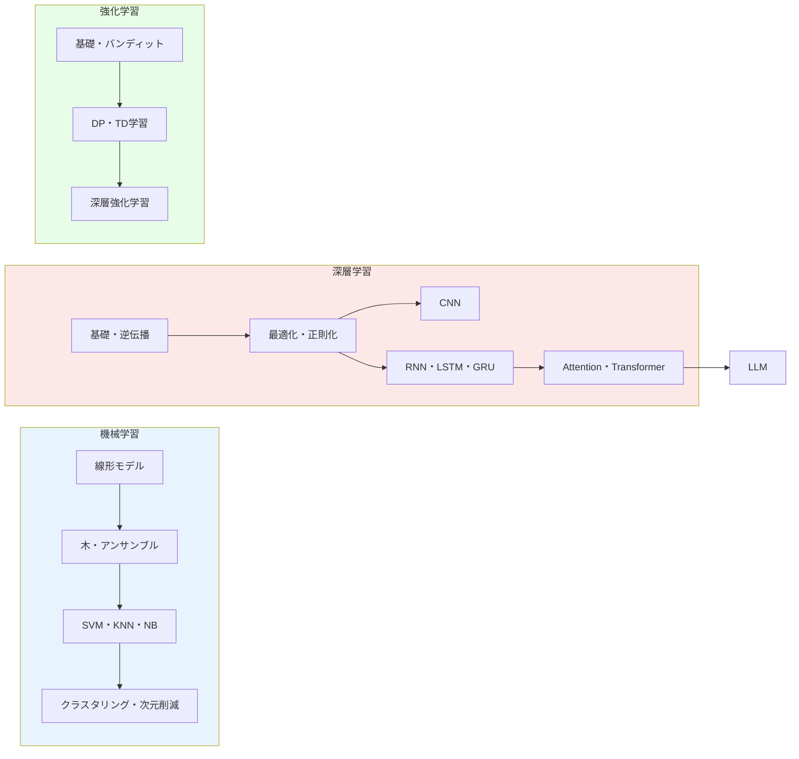

# ドキュメント目次

ML/DL/RL/LLMの各アルゴリズムの解説ドキュメント。

## 機械学習 (ML)

| ドキュメント | 内容 |
|---|---|
| [線形モデル](ml/01-linear-models.md) | 線形回帰、ロジスティック回帰、Ridge、Lasso |
| [木とアンサンブル](ml/02-tree-and-ensemble.md) | 決定木、ランダムフォレスト、勾配ブースティング |
| [SVM・KNN・ナイーブベイズ](ml/03-svm-knn-nb.md) | サポートベクターマシン、k近傍法、ガウシアンNB |
| [クラスタリングと次元削減](ml/04-unsupervised.md) | K-Means、DBSCAN、PCA、t-SNE |

## 深層学習 (DL)

| ドキュメント | 内容 |
|---|---|
| [基礎と逆伝播](dl/01-fundamentals.md) | ニューラルネットの構造、全結合層、活性化関数、損失関数、誤差逆伝播法 |
| [最適化と正則化](dl/02-optimization.md) | SGD、Adam、バッチ正規化、ドロップアウト |
| [CNN](dl/03-cnn.md) | 畳み込み層、im2col、プーリング層 |
| [RNN系列モデル](dl/04-rnn.md) | RNN、LSTM、GRU、埋め込み層 |
| [Attention と Transformer](dl/05-attention-transformer.md) | Self-Attention、Multi-Head Attention、Transformer |

## 強化学習 (RL)

| ドキュメント | 内容 |
|---|---|
| [基礎とバンディット](rl/01-fundamentals.md) | MDP、探索と活用、Epsilon-Greedy、UCB |
| [DP と TD学習](rl/02-dp-td.md) | 価値反復、方策反復、Q-Learning、SARSA |
| [深層強化学習](rl/03-deep-rl.md) | REINFORCE、DQN |

## LLM

| ドキュメント | 内容 |
|---|---|
| [LLM (GPT)](llm.md) | BPEトークナイザー、GPTアーキテクチャ、次トークン予測、テキスト生成 |

## 論文サーベイ

| ドキュメント | 内容 |
|---|---|
| [著名論文サーベイ](papers.md) | Backpropagation, LSTM, ResNet, Transformer, GPT, DQN 等の主要論文の要約と相互関係 |
