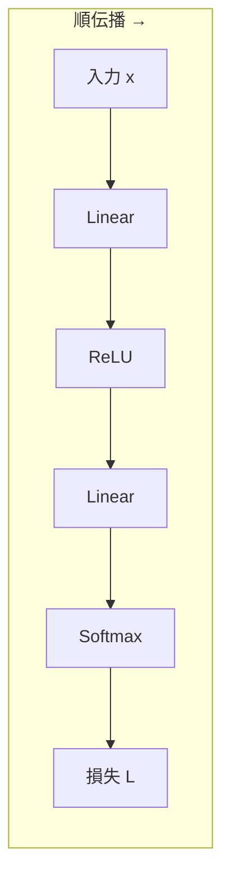
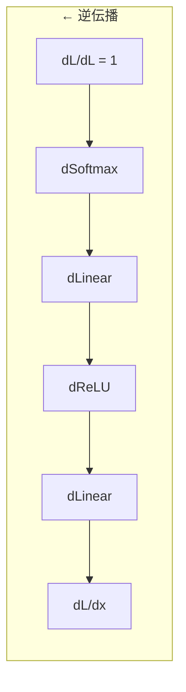
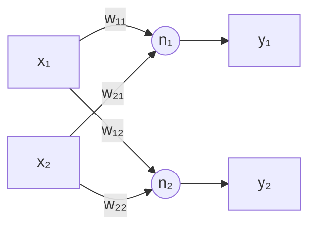

# ニューラルネットワークの基礎

## 計算グラフ

ニューラルネットワークは**計算グラフ**。入力から出力への計算を有向グラフとして表現し、逆方向に辿って勾配を計算する。





### 統一インターフェース

各層は同じインターフェースを持つ。これにより層を自由に組み合わせられる。

```python
class Layer:
    def forward(self, x):       # 入力 → 出力
    def backward(self, grad):   # 出力側の勾配 → 入力側の勾配
    def params_and_grads(self): # パラメータと勾配のリスト
```

---

## 全結合層 (Linear)



```
y = Xw + b
```

### 逆伝播

出力側の勾配 δ = dL/dy から：

```
dL/dw = Xᵀ × δ     ← 重みの勾配
dL/db = Σ δ          ← バイアスの勾配
dL/dX = δ × wᵀ      ← 入力への勾配（前の層に渡す）
```

### He初期化

```
w ~ N(0, √(2/fan_in))
```


ReLUが「半分のニューロンが0を出力する」ことを考慮して分散を2倍にしている。

---

## 活性化関数

活性化関数がなければ、多層のネットワークは1層と等価（行列の積は行列）。**非線形性**を入れることで複雑な関数を近似できる。

### 比較

```mermaid
graph TD
    subgraph ReLU["ReLU: max&#40;0, x&#41;"]
        R["✓ 勾配消失しにくい<br/>✓ 計算が速い<br/>✗ Dying ReLU問題"]
    end
    subgraph Sigmoid["Sigmoid: 1/&#40;1+e⁻ˣ&#41;"]
        S["✓ 出力が &#40;0,1&#41;<br/>✗ 飽和で勾配消失<br/>✗ 出力が0中心でない"]
    end
    subgraph Tanh["Tanh"]
        T["✓ 出力が &#40;-1,1&#41;<br/>✓ 0中心<br/>✗ 飽和で勾配消失"]
    end
    subgraph Softmax
        SM["全要素を確率分布に変換<br/>出力の総和 = 1<br/>多クラス分類の出力層"]
    end

    style ReLU fill:#2ecc71,color:#fff
    style Sigmoid fill:#3498db,color:#fff
    style Tanh fill:#9b59b6,color:#fff
    style Softmax fill:#e67e22,color:#fff
```



### ReLU の勾配

```
f(x)  = max(0, x)
f'(x) = 1  (x > 0)
      = 0  (x ≤ 0)
```

飽和しないため勾配消失が起きにくい。現代のDLで最も広く使われる。

### Softmax の数値安定化

```
softmax(xᵢ) = e^{xᵢ - max(x)} / Σ e^{xⱼ - max(x)}
```

最大値を引いてからexpを計算する。数学的に結果は同じだがオーバーフローを防ぐ。

---

## 損失関数

### MSE（回帰）

```
L = (1/n) Σ (yᵢ - ŷᵢ)²
```

### Cross-Entropy（分類）

```
L = -(1/n) Σ Σ yₖ log(pₖ)
```

Softmax + Cross-Entropy では勾配が極めてシンプルになる：

```
dL/d(logits) = (softmax(logits) - y_onehot) / n
```

---

## 誤差逆伝播法

### 連鎖律

```
dL/dx = dL/dy × dy/dx
```

各ノードが**局所微分**だけを知っていればよい。後ろから伝播する勾配と掛け合わせるだけ。

### 具体例

```mermaid
graph LR
    X[X] -->|"z₁ = XW₁+b₁"| Z1[z₁]
    Z1 -->|"a₁ = ReLU&#40;z₁&#41;"| A1[a₁]
    A1 -->|"z₂ = a₁W₂+b₂"| Z2[z₂]
    Z2 -->|"ŷ = softmax&#40;z₂&#41;"| Y[ŷ]
    Y -->|"L = CE&#40;ŷ, y&#41;"| L[L]
```



逆伝播：

```
δ₂ = ŷ - y                        ← Softmax+CE の勾配
dW₂ = a₁ᵀ × δ₂
δ₁ = δ₂ × W₂ᵀ ⊙ (z₁ > 0)        ← ReLU の勾配
dW₁ = Xᵀ × δ₁
```

### 計算効率

| 手法 | コスト |
|:---:|:---:|
| **数値微分** | パラメータ数 d 回の順伝播 |
| **逆伝播** | **1回**の逆伝播で全勾配 |

この効率差が深層学習を実用的にした。
