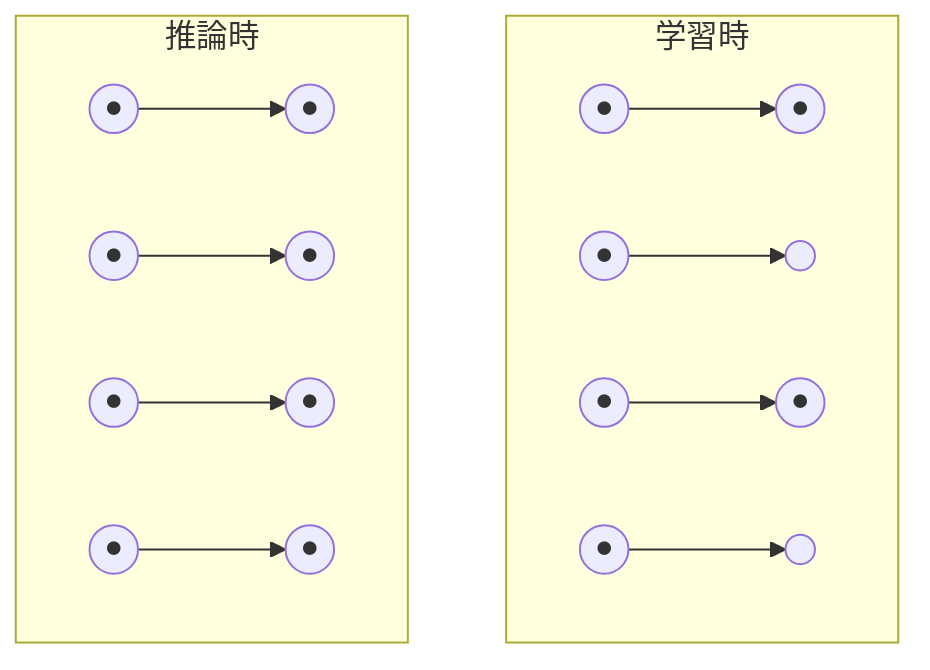

# 最適化と正則化

## オプティマイザ

勾配が計算できたら、パラメータを更新する。「どの方向にどれだけ動くか」を決める。

### SGD + Momentum


```
vₜ = μ × vₜ₋₁ + η × gₜ     ← 速度の更新（慣性 + 現在の勾配）
wₜ = wₜ₋₁ - vₜ               ← パラメータの更新
```

- 一貫した方向の勾配 → 加速
- 反対方向の勾配 → 相殺（振動を抑制）

### Adam

```mermaid
graph TD
    G["勾配 gₜ"] --> M["m: 勾配の移動平均<br/>&#40;1次モーメント&#41;<br/>→ 方向を安定化"]
    G --> V["v: 勾配²の移動平均<br/>&#40;2次モーメント&#41;<br/>→ 学習率を適応調整"]
    M --> BC["バイアス補正"]
    V --> BC
    BC --> Update["w -= η × m̂ / &#40;√v̂ + ε&#41;"]

    style Update fill:#2ecc71,color:#fff
```



```
mₜ = β₁mₜ₋₁ + (1-β₁)gₜ         ← 方向（Momentumの役割）
vₜ = β₂vₜ₋₁ + (1-β₂)gₜ²        ← 大きさ（適応学習率）
m̂ₜ = mₜ / (1 - β₁ᵗ)            ← バイアス補正
v̂ₜ = vₜ / (1 - β₂ᵗ)
wₜ = wₜ₋₁ - η × m̂ₜ / (√v̂ₜ + ε)
```

**適応学習率**: 勾配が大きいパラメータは学習率を下げ、小さいパラメータは上げる。

---

## バッチ正規化

### 問題：内部共変量シフト

深いネットワークでは、前の層の更新で各層の入力分布が変化し、学習が不安定になる。

### 解決策


```
μ = mean(x)       ← ミニバッチの平均
σ² = var(x)       ← ミニバッチの分散
x̂ = (x - μ) / √(σ² + ε)
y = γ × x̂ + β    ← 学習可能なパラメータ
```

### γ と β の役割

正規化だけでは表現力が失われる。γ（スケール）と β（シフト）を学習することで、ネットワークが正規化を「取り消す」ことも可能。

```
恒等変換を学習できる = 正規化が不要なら元に戻せる = 悪くなることはない
```

### 学習時 vs 推論時

```mermaid
graph TD
    subgraph 学習時
        A["ミニバッチの統計量を使用"]
        B["移動平均を蓄積"]
    end
    subgraph 推論時
        C["蓄積した移動平均を使用<br/>&#40;バッチの概念がないため&#41;"]
    end
    A --> B --> C
```



---

## ドロップアウト

### アイデア

学習時にランダムにニューロンを無効化して過学習を防ぐ。



### Inverted Dropout

```
学習時: y = x × mask / (1-p)    ← 1/(1-p) でスケーリング
推論時: y = x                    ← そのまま
```

`1/(1-p)` でスケーリングする理由：学習時は (1-p) の割合しか活性化しないので、推論時（全活性化）と出力の期待値を合わせる。

### アンサンブル解釈

ドロップアウトは **2ⁿ 個のサブネットワークのアンサンブル** を近似している。各ミニバッチで異なるサブネットが学習され、推論時にその平均が得られる。
