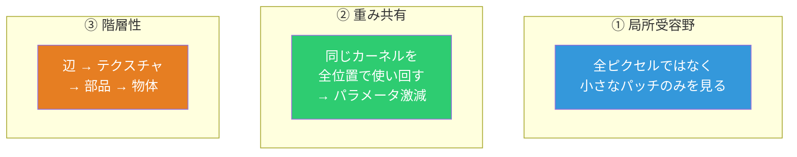

# 畳み込みニューラルネットワーク (CNN)

## 3つの原理



---

## 畳み込み演算

カーネル（フィルタ）を入力上でスライドさせ、要素積の和を計算する。

```
入力 (5×5)              カーネル (3×3)          出力 (3×3)
┌─┬─┬─┬─┬─┐           ┌─┬─┬─┐
│1│0│1│0│1│           │1│0│1│
├─┼─┼─┼─┼─┤           ├─┼─┼─┤
│0│1│0│1│0│    *      │0│1│0│      =     (畳み込み結果)
├─┼─┼─┼─┼─┤           ├─┼─┼─┤
│1│0│1│0│1│           │1│0│1│
├─┼─┼─┼─┼─┤           └─┴─┴─┘
│0│1│0│1│0│
├─┼─┼─┼─┼─┤
│1│0│1│0│1│
└─┴─┴─┴─┴─┘
```

### 出力サイズ

```
H_out = (H + 2×padding - kernel_size) / stride + 1
```

| パラメータ | 効果 |
|---|---|
| **kernel_size** | 受容野の大きさ |
| **stride** | スライドの歩幅（大きいとダウンサンプリング） |
| **padding** | 入力の周りにゼロを詰める（出力サイズを維持） |

---

## im2col による高速化

### 素朴な実装の問題

4重ループ（バッチ × 出力位置 × カーネル位置）→ 非常に遅い。

### im2col のアイデア

畳み込みを **行列積に変換** する。

```mermaid
graph LR
    subgraph "im2col 変換"
        Input["入力<br/>&#40;C, H, W&#41;"] --> Cols["パッチを列に並べる<br/>&#40;C×K×K, H_out×W_out&#41;"]
    end
    subgraph "行列積"
        Kernel["カーネル<br/>&#40;out_ch, C×K×K&#41;"] --> MatMul["行列積"]
        Cols --> MatMul
        MatMul --> Output["出力<br/>&#40;out_ch, H_out×W_out&#41;"]
    end

    style MatMul fill:#2ecc71,color:#fff
```



1. 入力の各パッチ（K×K）を列ベクトルとして並べる
2. カーネルも1次元に展開
3. 行列積を1回計算 → これが畳み込みの結果

NumPyの最適化された行列積が使え、ループ実装に比べて桁違いに高速。

---

## プーリング層

### MaxPool2D

各ウィンドウ内の最大値を取る。

```
入力 (4×4)                     出力 (2×2)
┌───┬───┬───┬───┐             ┌───┬───┐
│ 1 │ 3 │ 2 │ 1 │             │   │   │
├───┼───┤───┼───┤    2×2      │ 4 │ 6 │
│ 4 │ 2 │ 6 │ 4 │   MaxPool   ├───┼───┤
├───┼───┼───┼───┤   ──────→   │   │   │
│ 3 │ 1 │ 2 │ 3 │             │ 3 │ 3 │
├───┼───┤───┼───┤             └───┴───┘
│ 1 │ 2 │ 1 │ 1 │
└───┴───┴───┴───┘
```

効果：
1. **ダウンサンプリング**: サイズを縮小（計算量削減）
2. **平行移動ロバスト性**: 物体が少しずれても最大値は変わりにくい
3. **顕著な特徴の抽出**: 最大値 = 最も強い反応

逆伝播では最大値の位置にのみ勾配を伝播する。

### Flatten

```
(batch, C, H, W) → (batch, C×H×W)
```

畳み込み層の出力を全結合層に渡すための形状変換。

---

## CNNの全体像


浅い層は辺やテクスチャなど低レベルな特徴を、深い層は部品や物体全体など高レベルな特徴を学習する。
