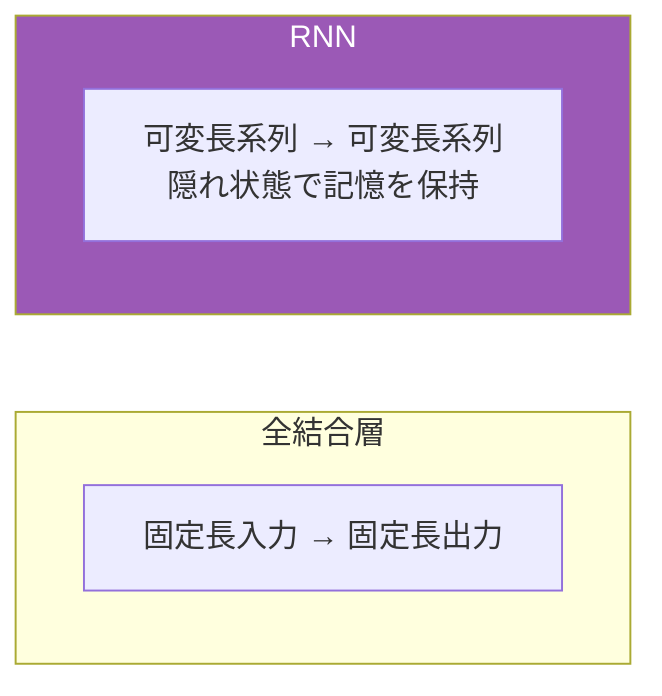
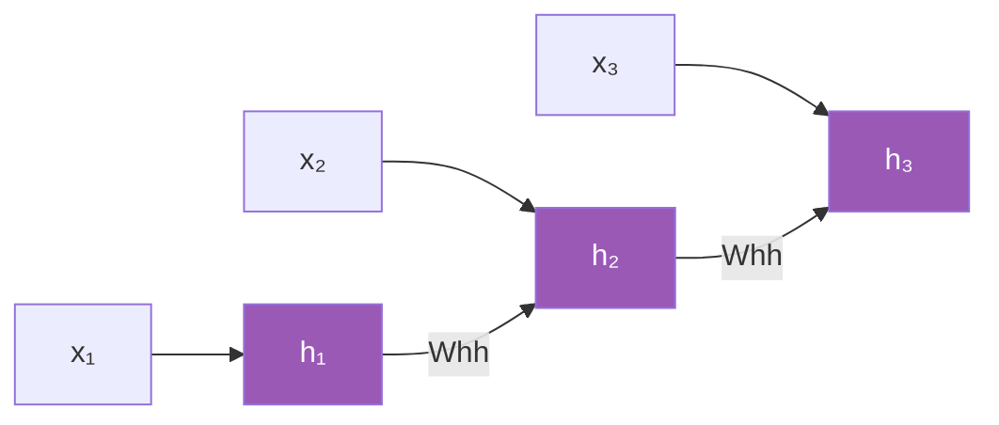
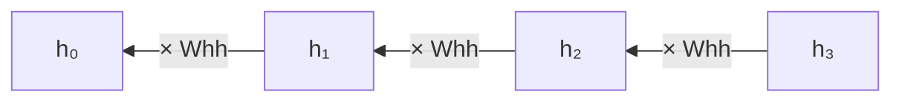
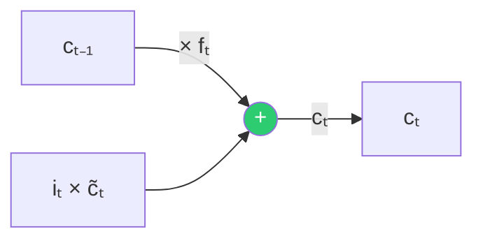

# RNN系列モデル

## 系列データの処理



---

## Vanilla RNN

### 構造



```
hₜ = tanh(Wxh × xₜ + Whh × hₜ₋₁ + b)
```

各時刻で入力 xₜ と前の隠れ状態 hₜ₋₁ を組み合わせて新しい隠れ状態 hₜ を計算。隠れ状態が「記憶」として機能する。

### 勾配消失問題

逆伝播を時間方向に遡ると（BPTT）、勾配が Whh の繰り返し乗算を受ける。



```
dL/dh₁ = dL/dh₃ × (Whh)² × (tanhの勾配)²
```

- Whhの最大特異値 < 1 → 勾配**消失**（遠い過去を学習できない）
- Whhの最大特異値 > 1 → 勾配**爆発**

---

## LSTM

### 核心：セル状態の高速道路



```
cₜ = fₜ × cₜ₋₁ + iₜ × c̃ₜ
```

セル状態は**加法的に更新**される。勾配は fₜ を通じてほぼ減衰せずに伝播する。これが「情報の高速道路」。

### 3つのゲート

```mermaid
graph TD
    Input["[hₜ₋₁, xₜ]"] --> FG["忘却ゲート fₜ<br/>σ&#40;Wf × [h,x] + bf&#41;<br/>前の記憶のどこを忘れるか"]
    Input --> IG["入力ゲート iₜ<br/>σ&#40;Wi × [h,x] + bi&#41;<br/>新情報のどこを記憶するか"]
    Input --> OG["出力ゲート oₜ<br/>σ&#40;Wo × [h,x] + bo&#41;<br/>記憶のどこを出力するか"]
    Input --> CT["候補値 c̃ₜ<br/>tanh&#40;Wc × [h,x] + bc&#41;"]

    FG --> Cell["cₜ = fₜ×cₜ₋₁ + iₜ×c̃ₜ"]
    IG --> Cell
    CT --> Cell
    Cell --> Hidden["hₜ = oₜ × tanh&#40;cₜ&#41;"]
    OG --> Hidden

    style FG fill:#e74c3c,color:#fff
    style IG fill:#3498db,color:#fff
    style OG fill:#f39c12,color:#fff
    style Cell fill:#2ecc71,color:#fff
```



| ゲート | 値が0のとき | 値が1のとき |
|:---:|---|---|
| **忘却 fₜ** | 前の記憶を完全消去 | 前の記憶を完全保持 |
| **入力 iₜ** | 新情報を無視 | 新情報を全部記憶 |
| **出力 oₜ** | 記憶を隠す | 記憶を全部出力 |

### 実装の工夫

4つのゲートの重み行列を1つに結合して一括計算：

```python
gates = concat @ self.W + self.b    # (batch, 4×hidden_size)
f, i, c_tilde, o = 4分割
```

---

## GRU

### LSTMの簡略版

セル状態を廃止し、ゲートを3→2に削減。パラメータが少なく計算が速い。

```mermaid
graph TD
    Input["[hₜ₋₁, xₜ]"] --> ZG["更新ゲート zₜ<br/>忘却と入力を統合"]
    Input --> RG["リセットゲート rₜ<br/>過去の隠れ状態をリセット"]

    RG --> Cand["候補 h̃ₜ = tanh&#40;W[rₜ×hₜ₋₁, xₜ]&#41;"]
    ZG --> Mix["hₜ = &#40;1-zₜ&#41;×hₜ₋₁ + zₜ×h̃ₜ"]
    Cand --> Mix

    style ZG fill:#3498db,color:#fff
    style RG fill:#e67e22,color:#fff
    style Mix fill:#2ecc71,color:#fff
```



```
hₜ = (1 - zₜ) × hₜ₋₁ + zₜ × h̃ₜ
```

`(1 - zₜ)` と `zₜ` の和が常に1 → 忘却と入力が連動する。

### LSTM vs GRU

| | LSTM | GRU |
|:---:|:---:|:---:|
| **ゲート数** | 3 + セル状態 | 2 |
| **パラメータ数** | 多い | 少ない |
| **性能** | タスク依存 | タスク依存 |
| **選択基準** | データが豊富なとき | データが少ないとき |

---

## 埋め込み層 (Embedding)

離散的なトークンID → 連続的な密ベクトル。

```mermaid
graph LR
    ID["トークンID: 42"] --> LUT["重み行列<br/>&#40;vocab_size × embed_dim&#41;<br/>の42行目を取り出す"]
    LUT --> Vec["密ベクトル<br/>[0.23, -0.15, 0.87, ...]"]

    style LUT fill:#3498db,color:#fff
```



### なぜ必要か

- One-hot: 語彙数の次元（数万〜数十万）でスパース
- 埋め込み: 低次元の密ベクトルで意味的な類似度を表現

### 逆伝播

`np.add.at` で該当インデックスに勾配を**累積**する。同じトークンが複数回出現する場合に正しく勾配を合算するため。
