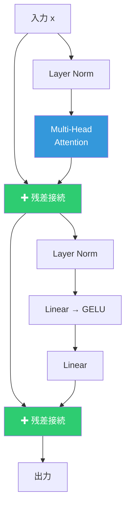

# Attention と Transformer

## RNNの限界からAttentionへ

```mermaid
graph TD
    Problem["RNNの問題:<br/>長い系列で情報が薄まる<br/>&#40;固定長ボトルネック&#41;"]
    -->
    Idea["Attentionのアイデア:<br/>必要な情報に直接アクセス"]
    -->
    Transformer["Transformer:<br/>RNNを完全に排除し<br/>Attentionのみで構成"]

    style Problem fill:#e74c3c,color:#fff
    style Idea fill:#f39c12,color:#fff
    style Transformer fill:#2ecc71,color:#fff
```



---

## Scaled Dot-Product Attention

### 情報検索のアナロジー

```mermaid
graph TD
    Q["Q &#40;Query&#41;<br/>今何を知りたいか"] --> Score["QKᵀ<br/>関連度スコア"]
    K["K &#40;Key&#41;<br/>各位置にどんな情報があるか"] --> Score
    Score --> Scale["÷ √dₖ<br/>スケーリング"]
    Scale --> SM["softmax<br/>→ 注意の重み"]
    SM --> Out["重み × V<br/>情報の加重平均"]
    V["V &#40;Value&#41;<br/>実際の情報の中身"] --> Out

    style Out fill:#2ecc71,color:#fff
```



```
Attention(Q, K, V) = softmax(QKᵀ / √dₖ) × V
```

### なぜ √dₖ でスケーリングするか

QとKの各要素が平均0・分散1なら、内積の分散は dₖ になる。

```
dₖ が大きい → 内積の値が大きい → softmax がほぼ one-hot → 勾配が消失
```

√dₖ で割って分散を1に戻し、softmax が適切に機能するようにする。

---

## Multi-Head Attention

### アイデア：複数の「観点」で注目する

```mermaid
graph TD
    Input["入力 &#40;batch, seq, d_model&#41;"]

    Input --> H1["Head 1<br/>例: 構文的関係"]
    Input --> H2["Head 2<br/>例: 意味的関係"]
    Input --> H3["Head 3<br/>例: 位置関係"]
    Input --> HN["Head N<br/>..."]

    H1 --> Concat["Concat"]
    H2 --> Concat
    H3 --> Concat
    HN --> Concat
    Concat --> WO["線形変換 Wo"]
    WO --> Out["出力"]

    style Concat fill:#3498db,color:#fff
    style Out fill:#2ecc71,color:#fff
```



```
headᵢ = Attention(Q×Wqⁱ, K×Wkⁱ, V×Wvⁱ)
MultiHead = Concat(head₁, ..., headₕ) × Wo
```

d_model を n_heads で分割し、各ヘッドが dₖ = d_model/n_heads 次元で独立にAttentionを計算。

---

## Transformer Encoder ブロック



### 残差接続の役割

```
output = x + SubLayer(LN(x))
```

入力をそのままショートカットして加算する。2つの効果：
1. 勾配が直接伝播するパスを確保（勾配消失を防ぐ）
2. 各サブレイヤーは「残差」（差分）のみ学習すればよい

### Layer Normalization

```
LN(x) = γ × (x - μ) / √(σ² + ε) + β
        └── 各サンプルの特徴量方向で正規化 ──┘
```

| | BatchNorm | LayerNorm |
|:---:|:---:|:---:|
| **正規化の方向** | バッチ方向 | 特徴量方向 |
| **用途** | CNN | Transformer / RNN |
| **バッチサイズ依存** | あり | なし |

### FFN（Feed-Forward Network）

```
FFN(x) = GELU(x×W₁ + b₁) × W₂ + b₂
```

位置ごとに独立に適用される2層のネットワーク。中間層は通常 4 × d_model。

Attentionが「位置間の関係」を捉え、FFNが「各位置の特徴量を変換する」。

---

## 勾配の流れの比較

深い層まで勾配を届ける方法の統一的理解：

```mermaid
graph TD
    subgraph "LSTM"
        A["cₜ = fₜ×cₜ₋₁ + iₜ×c̃ₜ<br/>加法的更新"]
    end
    subgraph "GRU"
        B["hₜ = &#40;1-z&#41;×hₜ₋₁ + z×h̃ₜ<br/>加法的混合"]
    end
    subgraph "Transformer"
        C["x + SubLayer&#40;x&#41;<br/>残差接続"]
    end

    A --- Principle["共通原理:<br/>加法的な情報経路で<br/>勾配の直通パスを確保"]
    B --- Principle
    C --- Principle

    style Principle fill:#e74c3c,color:#fff
```



すべて「入力をそのまま足す」経路を持つ。この経路を通る勾配は乗法的な減衰を受けない。
