# LLM (Large Language Model) フルスクラッチ実装

## 目次

1. [LLMとは何か](#llmとは何か)
2. [BPEトークナイザー](#bpeトークナイザー)
3. [GPTアーキテクチャ](#gptアーキテクチャ)
4. [因果的自己注意](#因果的自己注意)
5. [位置エンコーディング](#位置エンコーディング)
6. [次トークン予測と学習](#次トークン予測と学習)
7. [テキスト生成](#テキスト生成)
8. [スケーリング則](#スケーリング則)

---

## LLMとは何か

### 本質

LLMは**次のトークンを予測する確率モデル**。

```mermaid
graph LR
    T1["The"] --> T2["cat"] --> T3["sat"] --> T4["on"] --> Q["???"]
    Q --> Prob["P&#40;the&#41;=0.35<br/>P&#40;a&#41;=0.20<br/>P&#40;my&#41;=0.15<br/>..."]

    style Q fill:#f39c12,color:#fff
    style Prob fill:#2ecc71,color:#fff
```

```
P(t_{n+1} | t_1, t_2, ..., t_n)
```

この単純な定式化から翻訳、要約、推論、コード生成など多様な能力が創発する。

### なぜ「次のトークン予測」が汎用的能力を生むか

テキストにはあらゆる知識が含まれている。次のトークンを正確に予測するためには：

- 「東京は日本の___」→ 地理の知識が必要
- 「if x > 0: return___」→ プログラミングの知識が必要
- 「彼は怒っていたが、___」→ 心理・因果推論が必要

損失関数を十分に下げるためには、テキストに内在するあらゆるパターンを学習する必要がある。

### Transformerアーキテクチャの3つの派生

```mermaid
graph TD
    T["Transformer<br/>&#40;Vaswani et al., 2017&#41;"] --> ED["Encoder-Decoder<br/>T5, 原論文"]
    T --> EO["Encoder-only<br/>BERT<br/>双方向・穴埋め"]
    T --> DO["Decoder-only<br/>GPT<br/>左→右・自己回帰"]

    DO --> LLM["現在のLLM主流"]

    style DO fill:#2ecc71,color:#fff
    style LLM fill:#2ecc71,color:#fff
```

Decoder-onlyが主流になった理由：自己回帰的な生成と事前学習が自然に統合され、スケーリングの恩恵を最も受けやすい。

---

## BPEトークナイザー

### トークン化のスペクトル


### アルゴリズム

```mermaid
graph TD
    Init["初期語彙: 各バイト &#40;0-255&#41;"] --> Count["隣接ペアの出現頻度を数える"]
    Count --> Merge["最頻ペアを新トークンとしてマージ"]
    Merge --> Check{"語彙サイズ<br/>に到達?"}
    Check -->|No| Count
    Check -->|Yes| Done["完了"]

    style Done fill:#2ecc71,color:#fff
```

```
例: "aabaabaab"
  [a, a, b, a, a, b, a, a, b]     ← 初期状態
  → 最頻ペア (a,a) をマージ
  [aa, b, aa, b, aa, b]           ← 圧縮された
  → 最頻ペア (aa,b) をマージ
  [aab, aab, aab]                 ← さらに圧縮
```

### BPEの本質：情報理論的な圧縮

頻出パターンに短いIDを割り当てる = エントロピー符号化と類似。

バイトレベルBPE（初期語彙 = 0-255）を使うことで未知語が存在しなくなり、あらゆる入力を処理可能。

---

## GPTアーキテクチャ

### 全体構造

```mermaid
graph TD
    IDs["Token IDs<br/>&#40;batch, seq_len&#41;"] --> TE["Token Embedding"]
    PE["Position Embedding"] --> Add["✚"]
    TE --> Add
    Add --> Block1["Transformer Decoder Block 1<br/>&#40;Masked Attention → FFN&#41;"]
    Block1 --> Block2["Transformer Decoder Block 2"]
    Block2 --> BlockN["...Block N"]
    BlockN --> LN["Final Layer Norm"]
    LN --> Head["Linear → &#40;vocab_size&#41;"]
    Head --> Logits["logits<br/>&#40;batch, seq_len, vocab_size&#41;"]

    style IDs fill:#3498db,color:#fff
    style Logits fill:#2ecc71,color:#fff
```

### Decoder Block（Pre-LN構成）

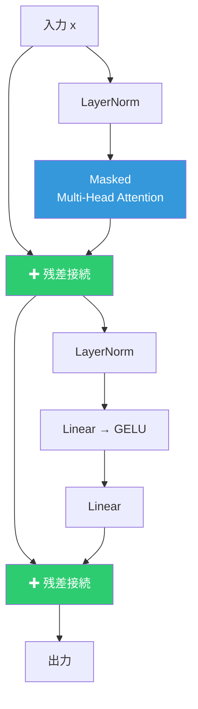

**Pre-LN** (GPT-2スタイル): LayerNormを先に適用。勾配が残差接続を通じて直接伝播し、学習が安定する。

### GELU活性化関数

```
GELU(x) = x × Φ(x) ≈ 0.5x(1 + tanh(√(2/π)(x + 0.044715x³)))
```

ReLUが x < 0 を一律0にするのに対し、GELUは確率的に抑制する。滑らかな非線形性。

---

## 因果的自己注意

### なぜマスクが必要か

```mermaid
graph LR
    subgraph "通常のSelf-Attention"
        A1["全位置を参照<br/>&#40;双方向&#41;"]
    end
    subgraph "因果的Self-Attention"
        A2["過去の位置のみ参照<br/>&#40;未来は見えない&#41;"]
    end

    style A2 fill:#e74c3c,color:#fff
```

自己回帰生成では未来のトークンはまだ存在しない。学習時にも推論時と同じ条件にするため、因果マスクで未来を隠す。

### 因果マスクの動作

```
Attention Scores に適用:

        t=0  t=1  t=2  t=3
t=0  [  ✓   ✗    ✗    ✗  ]    ← 自分だけ
t=1  [  ✓   ✓    ✗    ✗  ]    ← t=0,1 を参照
t=2  [  ✓   ✓    ✓    ✗  ]    ← t=0,1,2 を参照
t=3  [  ✓   ✓    ✓    ✓  ]    ← 全て参照

✗ の位置を -∞ にする → softmax 後に 0
```

### 重要な性質

系列全体を**一度のforward pass**で処理しても、各位置の出力は「その位置以前のトークンのみに依存する」。学習時は全位置の損失を並列に計算可能。

---

## 位置エンコーディング

Self-Attentionは集合演算で入力の順序を区別できない。位置エンコーディングを加えることで順序情報を与える。

```mermaid
graph LR
    subgraph "正弦波 &#40;固定&#41;"
        A["sin/cosの異なる周波数<br/>任意の長さに汎化可能<br/>学習不要"]
    end
    subgraph "学習可能 &#40;GPT&#41;"
        B["位置ごとのベクトルを学習<br/>実験的に同等以上の性能<br/>最大長に制限あり"]
    end
    subgraph "RoPE &#40;Llama等&#41;"
        C["位置を回転で表現<br/>相対位置に強い<br/>現代のLLMの主流"]
    end

    style B fill:#2ecc71,color:#fff
```

本実装では学習可能な位置エンコーディングを使用。

---

## 次トークン予測と学習

### 自己回帰的な学習

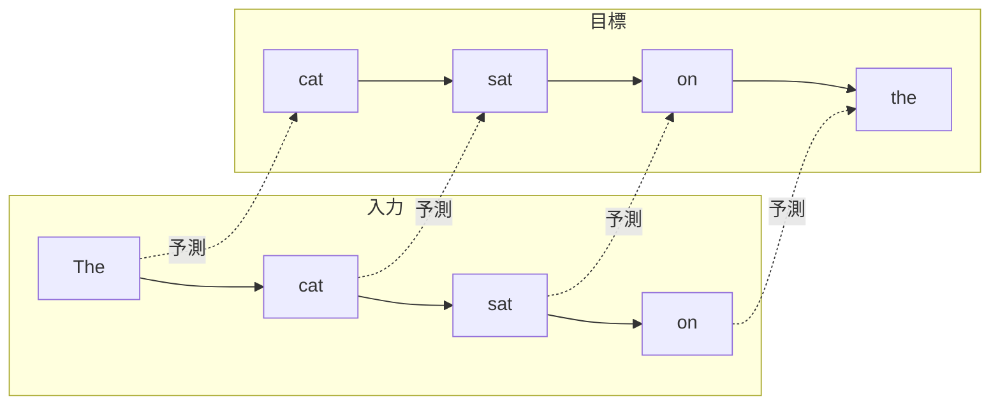

1つの系列から seq_len 個の学習サンプルが得られる。

### Cross-Entropy損失

```
L = -(1/T) Σ log P(target_t | input_{1:t})
```

**パープレキシティ** = exp(L)。「モデルが各位置で平均何個の候補から迷っているか」を直感的に表す。

### 学習の安定化テクニック

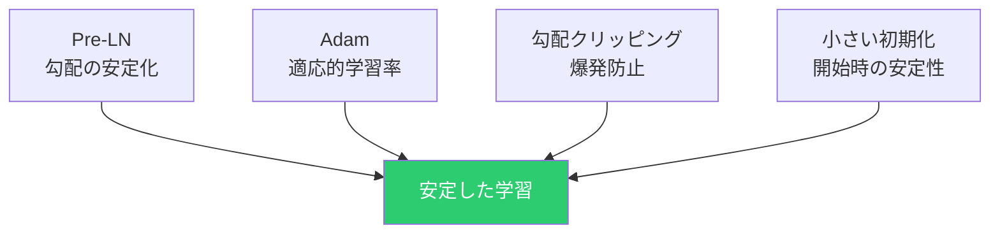

---

## テキスト生成

### 自己回帰生成

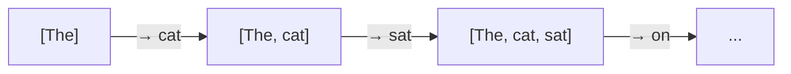

1トークンずつ生成し、生成結果を入力に追加して次を予測。

### サンプリング戦略の比較

```mermaid
graph TD
    Logits["logits"] --> Greedy["Greedy<br/>argmax<br/>決定的だが単調"]
    Logits --> Temp["Temperature<br/>分布の鋭さを制御<br/>T小:決定的 / T大:多様"]
    Logits --> TopK["Top-k<br/>上位k個のみ候補<br/>低確率トークンを排除"]
    Logits --> TopP["Top-p &#40;Nucleus&#41;<br/>累積確率pまでを候補<br/>分布形状に適応"]

    style TopP fill:#2ecc71,color:#fff
```

| 戦略 | 特徴 | 適応性 |
|:---:|---|:---:|
| **Greedy** | 常に最高確率を選択 | なし |
| **Temperature** | 分布の鋭さ/平坦さを調整 | 固定 |
| **Top-k** | 上位k個に限定 | kは固定 |
| **Top-p** | 累積確率pまでに限定 | 分布形状に適応 |

---

## スケーリング則

### Chinchilla則

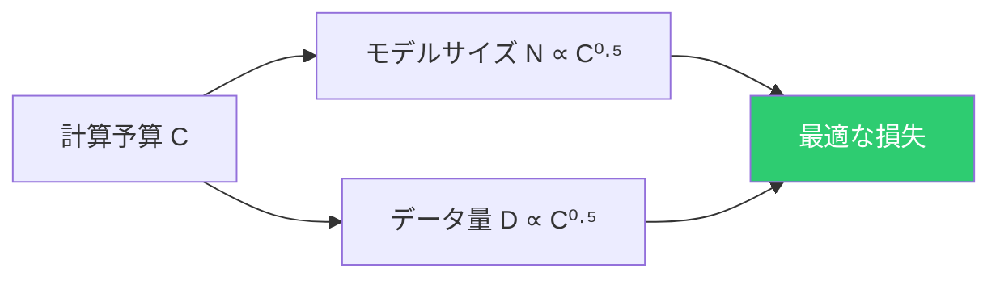

パラメータ数とデータ量は同じ比率でスケールさせるべき。大きなモデルを少ないデータで学習するのは非効率。

### 本実装のスケール

```
本実装: ~38K パラメータ
GPT-2:  ~1.5B パラメータ (×40,000)
GPT-3:  ~175B パラメータ (×4,600,000)
```

スケールは違っても、BPE・因果的Attention・次トークン予測・Top-pサンプリングの**原理は全く同じ**。
