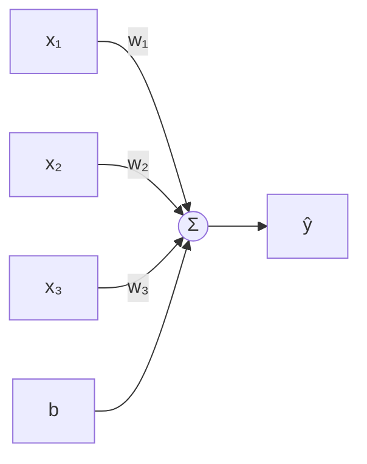
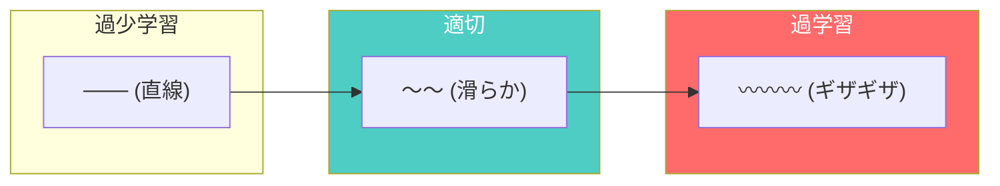

# 線形モデル

## 全体像

```mermaid
graph TD
    LR[線形回帰<br/>y = Xw + b] -->|出力を確率に変換| LogR[ロジスティック回帰<br/>σ&#40;Xw + b&#41;]
    LR -->|L2ペナルティ追加| Ridge[Ridge回帰<br/>L + α‖w‖²]
    LR -->|L1ペナルティ追加| Lasso[Lasso回帰<br/>L + α‖w‖₁]

    style LR fill:#4ecdc4,color:#fff
    style LogR fill:#ff6b6b,color:#fff
    style Ridge fill:#45b7d1,color:#fff
    style Lasso fill:#f9ca24,color:#333
```



4つのモデルはすべて **同じ骨格（線形モデル）** の変種。違いは「何をくっつけたか」だけ。

---

## 線形回帰

### 何をするか

データに最もよくフィットする直線（超平面）を引く。

```
予測値:  ŷ = x₁w₁ + x₂w₂ + ... + xₙwₙ + b
```



### 損失関数：MSE

予測と正解のズレの二乗を平均する。

```
L = (1/2n) Σ (yᵢ - ŷᵢ)²
```

> **なぜ二乗か？** 誤差が正規分布に従うと仮定すると、MSE最小化 = 最尤推定。つまりMSEを使う時点で「誤差は正規分布」と暗黙に仮定している。

### 2つの解き方

```mermaid
graph TD
    Problem[MSEを最小化したい] --> A{特徴量の数は?}
    A -->|少ない| Normal[正規方程式<br/>w = &#40;XᵀX&#41;⁻¹Xᵀy<br/>一発で解ける]
    A -->|多い| GD[勾配降下法<br/>w ← w - α∇L<br/>繰り返し更新]

    Normal --> |計算量 O&#40;d³&#41;| Result[最適な w]
    GD --> |計算量 O&#40;nd × イテレーション&#41;| Result
```



#### 勾配降下法

「目隠しで山を下る」。現在地の傾斜（勾配）だけを頼りに一歩ずつ進む。

```
繰り返し:
    w ← w - α × (1/n) × Xᵀ(Xw + b - y)
    b ← b - α × (1/n) × Σ(Xw + b - y)
```

- α（学習率）が大きすぎ → 発散（飛びすぎる）
- α が小さすぎ → 収束が遅い（牛歩）

#### 正規方程式

微分=0 の方程式を解いて一発で答えを出す。

```
w = (XᵀX)⁻¹Xᵀy
```

チューニング不要だが逆行列の計算 O(d³) がボトルネック。

---

## ロジスティック回帰

名前は「回帰」だが **分類** アルゴリズム。

### シグモイド関数

線形回帰の出力（実数全体）を [0, 1] に押し込む。

```
          1
σ(z) = ─────────
        1 + e⁻ᶻ

z ≪ 0  →  σ ≈ 0
z = 0  →  σ = 0.5
z ≫ 0  →  σ ≈ 1
```

```mermaid
graph LR
    x[入力 x] -->|Xw + b| z[z ∈ ℝ]
    z -->|σ&#40;z&#41;| p["p ∈ (0, 1)"]
    p -->|閾値 0.5| class[クラス 0 or 1]
```

### 損失関数：Binary Cross-Entropy

```
L = -(1/n) Σ [ yᵢ log(pᵢ) + (1-yᵢ) log(1-pᵢ) ]
```

> **なぜMSEを使わないのか？** σ との組み合わせでMSEは非凸になり局所最適に陥る。Cross-Entropyなら凸関数になり大域最適に到達できる。

### 勾配の美しさ

勾配を計算すると、線形回帰と **全く同じ形** になる。

```
dw = (1/n) × Xᵀ(p - y)
```

これはシグモイド × Cross-Entropy の組み合わせから生まれる数学的な性質で、指数族分布の一般的な性質に由来する。

### 線形回帰との比較

| | 線形回帰 | ロジスティック回帰 |
|:---:|:---:|:---:|
| **タスク** | 回帰 | 分類 |
| **出力** | 実数 | 確率 [0,1] |
| **活性化** | なし | シグモイド |
| **損失** | MSE | Cross-Entropy |
| **勾配の形** | Xᵀ(pred - y) | Xᵀ(pred - y) |

---

## Ridge回帰（L2正則化）

### 過学習の問題

特徴量が多い・データが少ないとき、モデルがノイズまで学習してしまう。



### アイデア：重みの大きさにペナルティ

```
L = (1/2n) ‖y - Xw‖² + α ‖w‖²
    ───────────────────   ──────
    データへの適合度        正則化項
```

αが大きいほど重みを小さく保とうとする → モデルが単純になる。

### 解析解

```
w = (XᵀX + αI)⁻¹Xᵀy
```

αI を加えることで XᵀX が常に**正則**（逆行列が存在）になる。これが「Ridge（尾根）」の名前の由来。多重共線性の問題を解消する。

---

## Lasso回帰（L1正則化）

### L1 vs L2 の核心的な違い

```
Ridge (L2):  α ‖w‖²  → 全重みを均等に縮小
Lasso (L1):  α ‖w‖₁  → 一部の重みを完全に 0 にする
```



```mermaid
graph TD
    subgraph "L2 (Ridge): 円形の制約"
        A["等高線と円が<br/>接する点が解<br/>→ 角がないので<br/>軸上に来にくい"]
    end
    subgraph "L1 (Lasso): 菱形の制約"
        B["等高線と菱形が<br/>接する点が解<br/>→ 角があるので<br/>軸上&#40;w=0&#41;で接しやすい"]
    end
```

Lassoが重みを0にできる = **特徴量選択**。100個の特徴量のうち重要な10個だけを自動的に選んでくれる。

### 座標降下法

L1ノルムは0で微分不可能（絶対値の角）。通常の勾配降下法が使えない。

代わりに**1つの重みだけを動かし**（他は固定）、最適値を求める操作を全重みに繰り返す。

```mermaid
graph LR
    A["w₁を最適化<br/>&#40;w₂,w₃固定&#41;"] --> B["w₂を最適化<br/>&#40;w₁,w₃固定&#41;"] --> C["w₃を最適化<br/>&#40;w₁,w₂固定&#41;"] --> A
```



各ステップの解は**ソフト閾値関数**で与えられる：

```
soft_threshold(ρ, α) = sign(ρ) × max(|ρ| - α, 0)
```

|ρ| < α のとき結果が 0 になる。これがスパース解を生むメカニズム。
