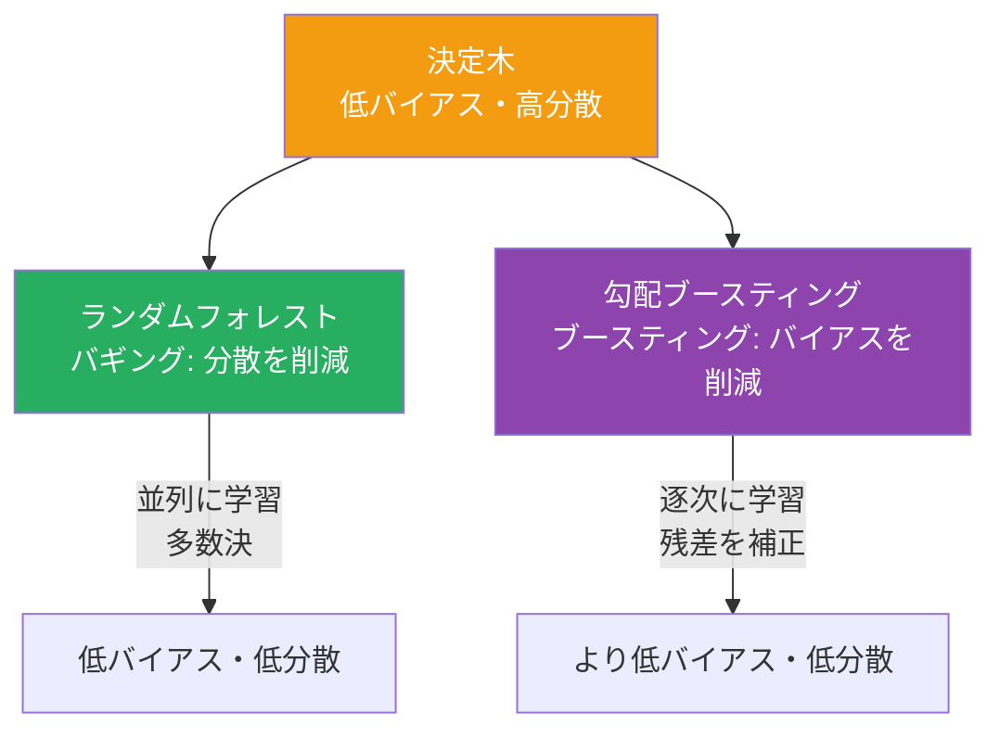
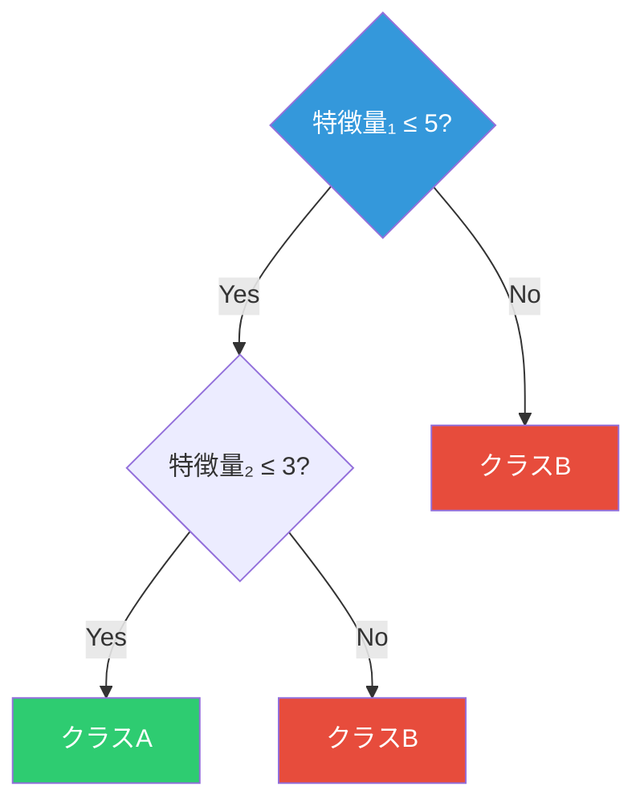
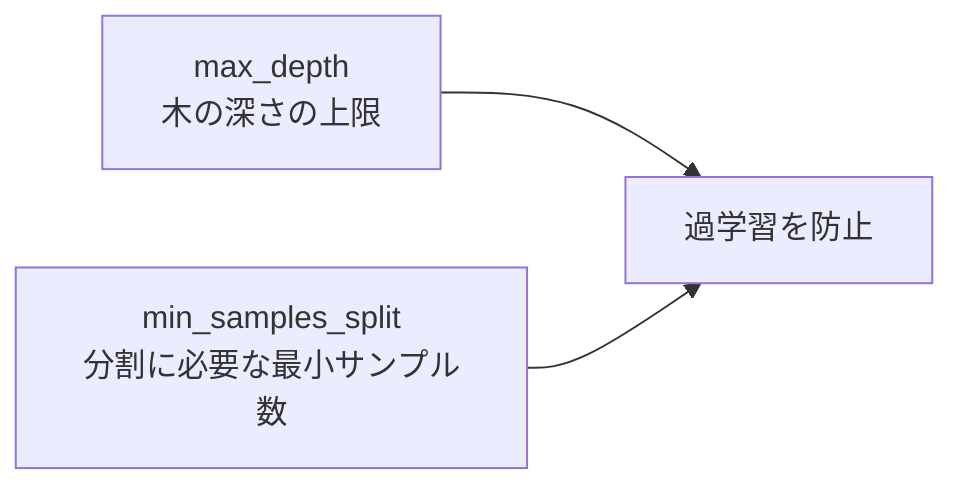
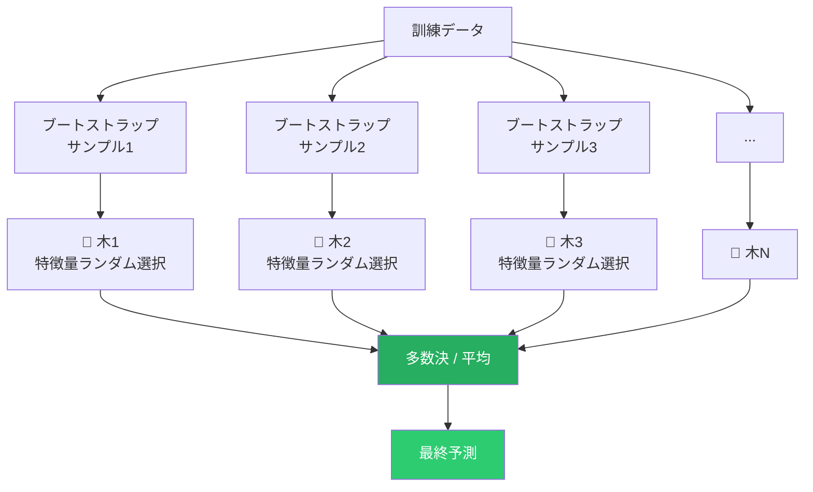

# 木とアンサンブル

## 全体像



---

## 決定木

### 何をするか

「はい/いいえ」の質問を連鎖させてデータを分類・予測する。



本質は**特徴量空間を矩形領域に再帰的に分割する**こと。

### CARTアルゴリズム

各ノードで「どの特徴量のどの値で分割するか」を**貪欲に**決定する。

#### 分類：ジニ不純度

```
Gini(S) = 1 - Σ pₖ²
```

| 状態 | Gini |
|:---:|:---:|
| 全員同じクラス | 0（純粋） |
| 2クラスが半々 | 0.5（最大不純度） |

```mermaid
graph TD
    Parent["親ノード<br/>Gini = 0.48"] -->|分割| Left["左の子<br/>Gini = 0.0 ✓"]
    Parent -->|分割| Right["右の子<br/>Gini = 0.32"]

    Info["情報利得 = 0.48 - 加重平均&#40;0.0, 0.32&#41;"]

    style Parent fill:#f39c12,color:#fff
    style Left fill:#2ecc71,color:#fff
```



全特徴量×全閾値を走査し、**情報利得が最大**となる分割を選ぶ。

#### 回帰：分散の削減

ジニ不純度の代わりに分散を使い、分散の削減量が最大の分割を選ぶ。

### 過学習の制御

制限なく成長させると訓練データを完全記憶してしまう。



---

## ランダムフォレスト

### アイデア：三人寄れば文殊の知恵

1本の決定木は不安定（データが少し変わると結果が大きく変わる）。多数の木の予測を集約すれば安定する。



### 2つのランダム化

| ランダム化 | 効果 |
|---|---|
| **ブートストラップサンプリング** | 各木が異なるデータで学習 → 木の多様性 |
| **特徴量のランダム選択**（各ノードで √d 個） | 木同士の相関を低下 → 平均化の効果が増大 |

### なぜ過学習しないか

独立な推定量の平均の分散は `Var/n` に減少する。木を増やしても**分散が減るだけでバイアスは増えない**ため、過学習しない（稀有な性質）。

---

## 勾配ブースティング

### アイデア：前のモデルの失敗を次が補う

ランダムフォレストが「多数の木を独立に」学習するのに対し、勾配ブースティングは**逐次的に**木を追加する。

```mermaid
graph LR
    F0["F₀ = mean&#40;y&#41;"] --> R1["残差₁ = y - F₀"]
    R1 --> H1["🌳 h₁: 残差₁を学習"]
    H1 --> F1["F₁ = F₀ + η h₁"]
    F1 --> R2["残差₂ = y - F₁"]
    R2 --> H2["🌳 h₂: 残差₂を学習"]
    H2 --> F2["F₂ = F₁ + η h₂"]
    F2 --> R3["..."]

    style F0 fill:#8e44ad,color:#fff
    style F1 fill:#8e44ad,color:#fff
    style F2 fill:#8e44ad,color:#fff
```



### なぜ「勾配」ブースティングか

残差 `y - F(x)` は実はMSEの**負の勾配**。

```
-∂L/∂F(x) = -(F(x) - y) = y - F(x) = 残差
```

つまり各ステップで**関数空間での勾配降下法**を行っている。

### 学習率 η の役割

η を小さくして木を増やす方が汎化性能が高い。「小さなステップで慎重に最適化する」ことに対応する。

### ランダムフォレストとの比較

| | ランダムフォレスト | 勾配ブースティング |
|:---:|:---:|:---:|
| **学習方式** | 並列（独立） | 逐次（依存） |
| **低減するもの** | 分散 | バイアス（+分散） |
| **過学習リスク** | 低い | あり |
| **チューニング** | 容易 | やや難しい |
| **各木の深さ** | 深い | 浅い（3〜8程度） |
