# SVM・KNN・ナイーブベイズ

3つの異なる哲学を持つ分類アルゴリズム。


---

## サポートベクターマシン (SVM)

### アイデア：マージン最大化

2クラスを分離する超平面は無数にある。その中で**最も「余裕」のある**境界を選ぶ。

```
   クラス +1                          クラス -1
      ●                                   ○
        ●        ← マージン →           ○
          ●  |←───────────────→|   ○
        ●    |   決定境界        |  ○
      ●      |                   | ○
             |                   |
     サポートベクター         サポートベクター
```

マージン = 決定境界と最も近いデータ点（サポートベクター）との距離。

### ヒンジ損失

```
hinge(y, f(x)) = max(0, 1 - y × f(x))
```



```mermaid
graph LR
    subgraph "y × f&#40;x&#41; ≥ 1"
        A["正しく分類 & マージン外<br/>→ 損失 0"]
    end
    subgraph "0 < y × f&#40;x&#41; < 1"
        B["正しく分類だがマージン内<br/>→ ペナルティあり!"]
    end
    subgraph "y × f&#40;x&#41; ≤ 0"
        C["誤分類<br/>→ 大きなペナルティ"]
    end
```

核心：**正しく分類していても、マージン内にいれば罰する**。これがマージン最大化を実現する。

### 最適化

```
min  (1/2)‖w‖² + C Σ max(0, 1 - yᵢ(w・xᵢ + b))
      ────────   ──────────────────────────────
      マージン最大化        誤分類ペナルティ
```

本実装ではSGDでヒンジ損失を直接最適化。

---

## k近傍法 (KNN)

### アイデア：類は友を呼ぶ

学習フェーズでは**何もしない**（データを保存するだけ）。予測時にk個の近傍点を探して多数決する。

```mermaid
graph TD
    New["❓ 新しいデータ点"] --> Dist["全訓練データとの<br/>距離を計算"]
    Dist --> Sort["距離が小さい順に<br/>k個を選択"]
    Sort --> Vote["多数決&#40;分類&#41;<br/>or 平均&#40;回帰&#41;"]
    Vote --> Pred["予測"]

    style New fill:#f39c12,color:#fff
    style Pred fill:#2ecc71,color:#fff
```



### k の選び方


### 弱点

| 問題 | 原因 |
|---|---|
| **計算コスト** O(n×d) | 予測時に全データとの距離計算が必要 |
| **次元の呪い** | 高次元では全データ点間の距離が均一化し「近い」が意味をなさなくなる |

---

## ナイーブベイズ

### アイデア：ベイズの定理で分類

「データがクラスCから生成される確率」をモデル化し、ベイズの定理で反転させる。

```mermaid
graph LR
    Prior["P&#40;y&#41;<br/>事前確率<br/>各クラスの頻度"] --> Bayes["ベイズの定理"]
    Likelihood["P&#40;x|y&#41;<br/>尤度<br/>クラスyでのデータ分布"] --> Bayes
    Bayes --> Posterior["P&#40;y|x&#41;<br/>事後確率<br/>データxのクラス"]
```



```
P(y|x) = P(x|y) × P(y) / P(x)
```

### 「ナイーブ」な仮定

全特徴量が**条件付き独立**であると仮定する。

```
P(x₁, x₂, ..., xd | y) = P(x₁|y) × P(x₂|y) × ... × P(xd|y)
```

この仮定は通常成り立たない。しかし分類に必要なのは確率の**順序**だけで正確な**値**ではないため、仮定が崩れても驚くほどよく機能する。

### ガウシアン仮定

各特徴量がクラスごとに正規分布に従うと仮定：

```
P(xᵢ | y=c) = N(xᵢ; μc,i, σ²c,i)
```

学習は各クラスの各特徴量の**平均と分散を計算するだけ**。極めて高速。

### 対数空間での計算

確率の積はアンダーフローを起こすため、対数を取って積を和に変換：

```
log P(y|x) = log P(y) + Σ log P(xᵢ|y)
```

### 3つのアルゴリズムの比較

| | SVM | KNN | ナイーブベイズ |
|:---:|:---:|:---:|:---:|
| **学習** | 最適化問題を解く | 何もしない | 統計量を計算 |
| **予測** | 決定境界との距離 | k近傍の多数決 | 事後確率の比較 |
| **仮定** | 線形分離可能 | 近傍が類似 | 特徴量が独立 |
| **学習速度** | 遅い | 瞬時 | 速い |
| **予測速度** | 速い | 遅い (O(n)) | 速い |
