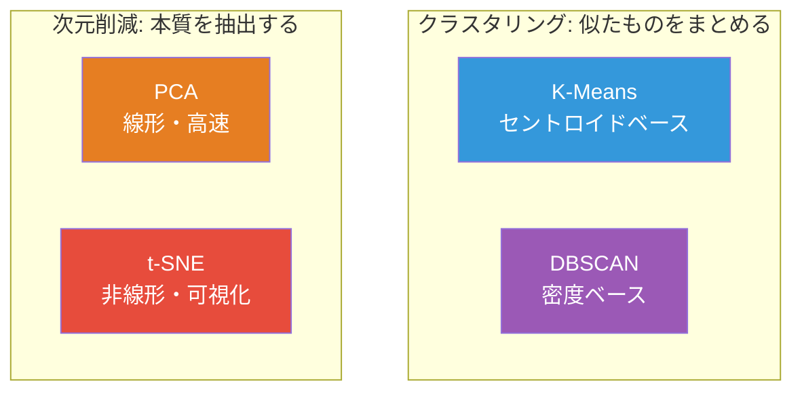
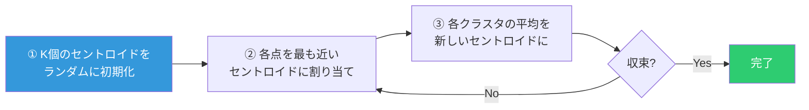
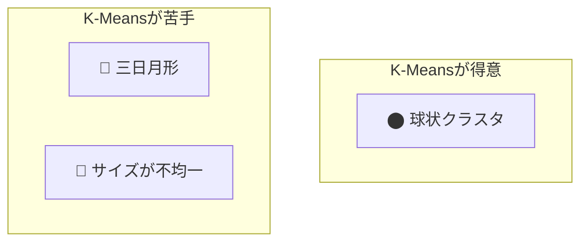
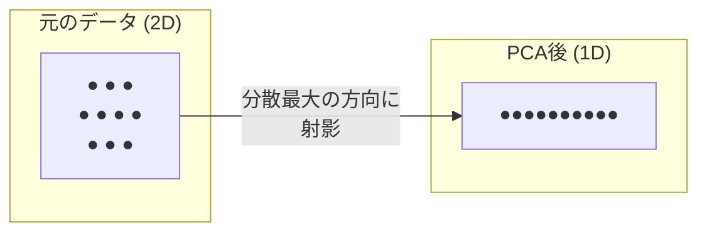
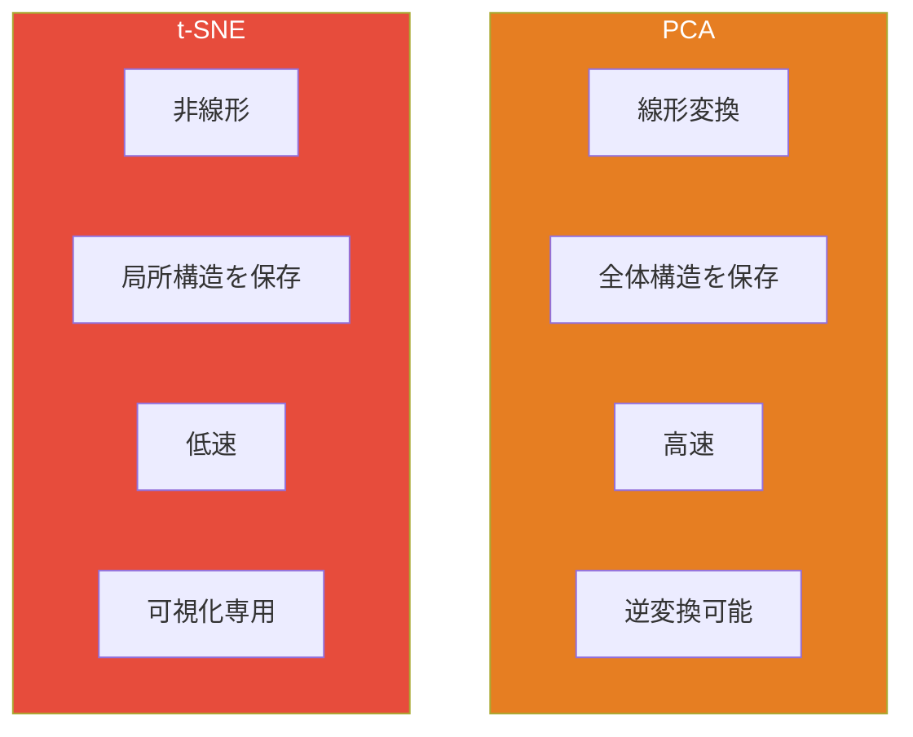
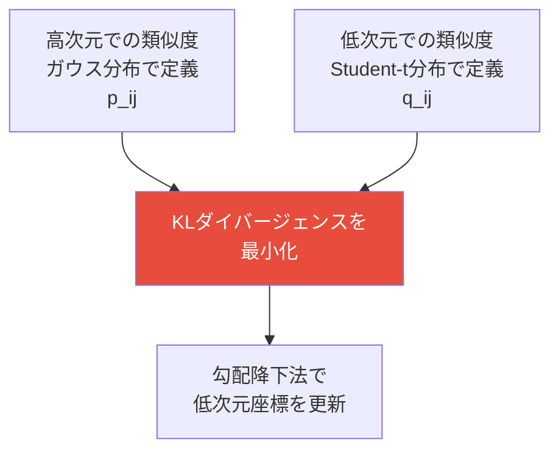

# クラスタリングと次元削減

正解ラベルなしで、データの内在的な構造を発見する。



---

## K-Means

### アルゴリズム



### EMアルゴリズムとしての解釈

```
目的関数: J = Σₖ Σ_{x∈Cₖ} ‖x - μₖ‖²
```

| ステップ | 操作 | EMとの対応 |
|:---:|---|:---:|
| **割り当て** | μを固定してクラスタを最適化 | E-step |
| **更新** | クラスタを固定してμを最適化 | M-step |

各ステップでJは単調に減少し収束する。ただし**局所最適解**に陥る可能性がある。

### 限界



- クラスタ数Kを事前に指定する必要がある
- 球状のクラスタしか検出できない
- 外れ値に敏感

---

## DBSCAN

### アイデア：密度でクラスタを定義する

```mermaid
graph TD
    subgraph "3種類の点"
        Core["● コア点<br/>eps内にmin_samples個以上"]
        Border["◐ ボーダー点<br/>コア点のeps内にいる"]
        Noise["○ ノイズ点<br/>どちらでもない"]
    end

    Core --> |"密度到達可能な<br/>コア点をつなぐ"| Cluster["クラスタ"]
    Border --> Cluster
    Noise --> Outlier["外れ値 &#40;-1&#41;"]

    style Core fill:#2ecc71,color:#fff
    style Border fill:#f39c12,color:#fff
    style Noise fill:#95a5a6,color:#fff
```



### K-Meansとの比較

| | K-Means | DBSCAN |
|:---:|:---:|:---:|
| **クラスタ数** | 事前指定 | 自動検出 |
| **クラスタ形状** | 球状のみ | 任意の形状 |
| **ノイズ** | 全点をクラスタに割り当て | ノイズ点を除外 |
| **パラメータ** | K | eps, min_samples |

---

## 主成分分析 (PCA)

### アイデア：分散が最大の方向を見つける



### アルゴリズム



```mermaid
graph TD
    A["① データを中心化<br/>&#40;平均を引く&#41;"] --> B["② 共分散行列を計算<br/>C = &#40;1/n&#41; XᵀX"]
    B --> C["③ 固有値分解<br/>Cw = λw"]
    C --> D["④ 固有値が大きい順に<br/>k個の固有ベクトルを選択"]
    D --> E["⑤ 射影<br/>Z = X × W"]

    style A fill:#e67e22,color:#fff
    style E fill:#2ecc71,color:#fff
```

### なぜ固有ベクトルか

分散最大化問題をラグランジュ乗数法で解くと：

```
max wᵀCw  subject to ‖w‖ = 1
    ↓
Cw = λw  （固有値問題）
```

**固有ベクトル** = 分散最大の方向、**固有値** = その方向の分散量。

### 寄与率

```
寄与率ₖ = λₖ / Σλᵢ
```

「第k主成分がデータの分散の何%を説明するか」。累積寄与率90%を目安にk個を選ぶ。

---

## t-SNE

### PCAとの違い



### 核心的なアイデア



### なぜ Student-t分布か（Crowding問題）

高次元では「中程度の距離」の点が大量にある。これを低次元に押し込むと近くに密集してしまう。

```
ガウス分布 (高次元)     Student-t分布 (低次元)
    ╱╲                       ─╲
   ╱  ╲                    ╱   ╲
  ╱    ╲                  ╱     ╲
 ╱      ╲                ╱       ╲
╱        ╲              ╱     裾が重い → 遠い点にも
                              ゼロでない確率を割り当て
```

Student-t分布の**重い裾**が、遠い点を低次元でも遠く配置することを許容する。

### Perplexity

σᵢ は各点ごとに異なり、perplexity パラメータで制御する。

| Perplexity | 効果 |
|:---:|---|
| **小** (5〜10) | 局所構造重視。小さなクラスタが見える |
| **大** (30〜50) | 大域構造重視。大きな構造が見える |

二分探索で各点の適切な σᵢ を決定する。
