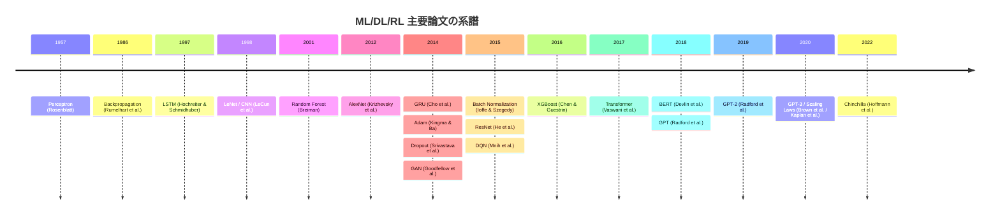
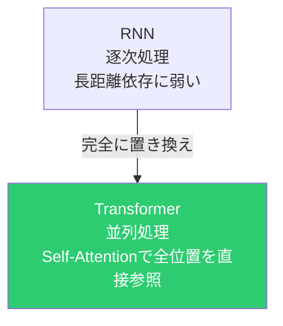
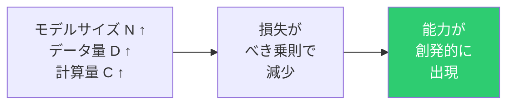
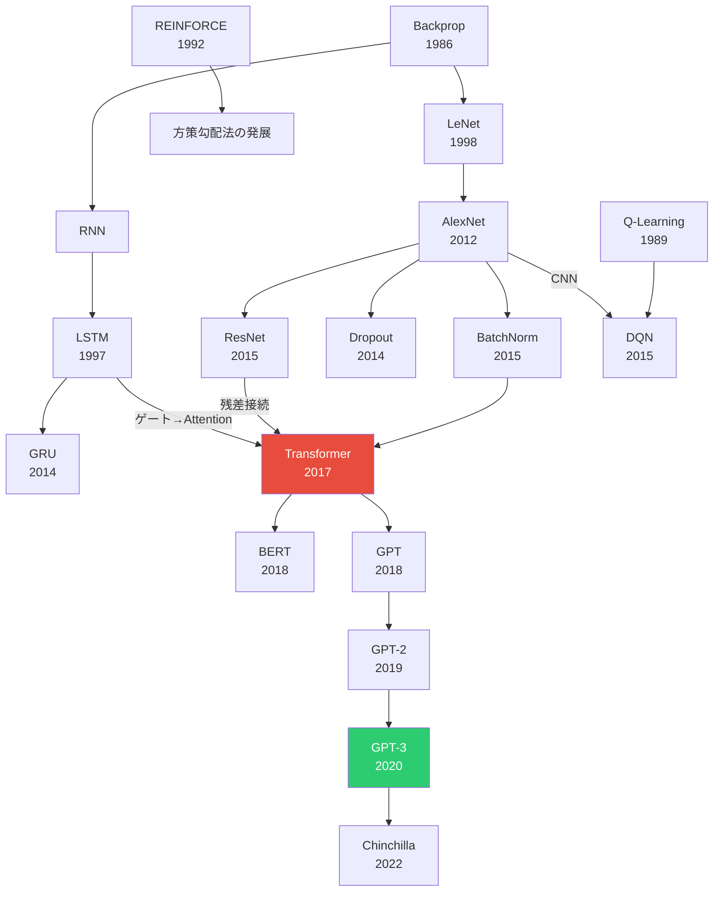

# 著名論文サーベイ

本リポジトリに実装したアルゴリズムの基盤となる論文を、歴史的な流れに沿ってまとめる。

---

## 機械学習

### 決定木・アンサンブル

#### Random Forests (Breiman, 2001)

**"Random Forests", Machine Learning, 45(1), 5-32**

- バギング + 特徴量のランダムサンプリングを組み合わせたアンサンブル学習
- 個々の木は高分散だが、ランダム化によって木同士の相関を下げ、平均化で分散を低減
- 過学習しにくく、ハイパーパラメータの調整が容易
- OOB (Out-of-Bag) 誤差による交差検証不要の汎化性能評価を提案

> **核心的な貢献**: ランダム化が多様性を生み、多様性がアンサンブルの強さを生む。

#### XGBoost (Chen & Guestrin, 2016)

**"XGBoost: A Scalable Tree Boosting System", KDD 2016**

- 勾配ブースティングのスケーラブルな実装
- 2次のテイラー展開による損失の近似で高速な分割点探索
- L1/L2正則化をツリー構築に組み込み
- Column subsampling、欠損値の自動処理
- Kaggleの多数のコンペティションで支配的な成績

> **核心的な貢献**: 勾配ブースティングを「実用的に最強の手法」にまで押し上げたエンジニアリング。

### 次元削減

#### t-SNE (van der Maaten & Hinton, 2008)

**"Visualizing Data using t-SNE", JMLR, 9, 2579-2605**

- 高次元データの可視化に特化した非線形次元削減
- 高次元でガウス分布、低次元でStudent-t分布を使う非対称な設計
- Student-t分布の重い裾がcrowding問題を解決
- 各点のperplexityを二分探索で調整

> **核心的な貢献**: 「低次元でStudent-t分布を使う」という一つのアイデアで可視化の質を劇的に改善。

---

## 深層学習：基礎

### 誤差逆伝播法

#### Backpropagation (Rumelhart, Hinton & Williams, 1986)

**"Learning representations by back-propagating errors", Nature, 323, 533-536**

- 多層ニューラルネットワークの学習法として連鎖律に基づく逆伝播を提案
- 隠れ層の重みを効率的に学習する方法を確立
- これ以前は隠れ層の学習が困難で、ニューラルネットの実用化が進まなかった

> **核心的な貢献**: 「出力の誤差を逆方向に伝播させる」という計算の対称性を発見・定式化。

### 活性化関数・初期化

#### ReLU (Nair & Hinton, 2010) / Glorot & Bengio (2011)

- **"Rectified Linear Units Improve Restricted Boltzmann Machines", ICML 2010**
- **"Understanding the difficulty of training deep feedforward neural networks", AISTATS 2011** (Xavier初期化)

ReLUの利点：
- 勾配の飽和がない（シグモイド/tanhの問題を解決）
- 計算コストが極小（比較と選択のみ）
- スパースな活性化

#### He初期化 (He et al., 2015)

**"Delving Deep into Rectifiers", ICCV 2015**

- ReLUに適した初期化: `w ~ N(0, √(2/fan_in))`
- ReLUが半分のニューロンを0にする効果を考慮して分散を2倍に

---

## 深層学習：最適化と正則化

### Adam (Kingma & Ba, 2015)

**"Adam: A Method for Stochastic Optimization", ICLR 2015**

- 勾配の1次モーメントと2次モーメントの適応的推定
- パラメータごとの学習率の自動調整
- バイアス補正で学習初期の不安定性を解消

> **核心的な貢献**: Momentum（方向の安定化）とRMSProp（大きさの適応）を統合し、ほぼすべてのタスクで「とりあえずAdam」が通用する汎用性を実現。

### Batch Normalization (Ioffe & Szegedy, 2015)

**"Batch Normalization: Accelerating Deep Network Training by Reducing Internal Covariate Shift", ICML 2015**

- 各層の入力をミニバッチ単位で正規化
- 学習可能なγ, βで表現力を維持
- 学習率を大きくでき、学習速度が劇的に向上
- 正則化効果もある

> **核心的な貢献**: 「各層の入力分布を安定化する」というシンプルなアイデアで深層学習の実用性を大幅に向上。

### Dropout (Srivastava et al., 2014)

**"Dropout: A Simple Way to Prevent Neural Networks from Overfitting", JMLR, 15(1), 1929-1958**

- 学習時にランダムにニューロンを無効化
- 指数的な数のサブネットワークのアンサンブルとして解釈可能
- 特定のニューロンへの共依存を防ぐ

> **核心的な貢献**: 「ランダムに壊す」ことが「強くする」というカウンターインテュイティブな洞察。

---

## 深層学習：アーキテクチャ

### CNN

#### LeNet (LeCun et al., 1998)

**"Gradient-Based Learning Applied to Document Recognition", Proc. IEEE, 86(11), 2278-2324**

- 畳み込み + プーリング + 全結合の基本構造を確立
- 手書き数字認識で実用的な成功
- 局所受容野、重み共有、空間的ダウンサンプリングの3原理

#### AlexNet (Krizhevsky, Sutskever & Hinton, 2012)

**"ImageNet Classification with Deep Convolutional Neural Networks", NeurIPS 2012**

- ImageNetでの圧倒的な勝利（エラー率を10%以上改善）
- ReLU、Dropout、データ拡張、GPUの活用
- 深層学習ブームの起爆剤

> **核心的な貢献**: 「深いネットワーク + 大規模データ + GPU」の組み合わせが従来手法を圧倒することを実証。

#### ResNet (He et al., 2015)

**"Deep Residual Learning for Image Recognition", CVPR 2016**

```mermaid
graph LR
    X["入力 x"] --> F["F&#40;x&#41;"]
    X --> Add["✚"]
    F --> Add
    Add --> Out["x + F&#40;x&#41;"]

    style Add fill:#2ecc71,color:#fff
```

- 残差接続（skip connection）: `y = F(x) + x`
- 152層のネットワークの学習を可能に（以前は20層程度が限界）
- 勾配の直通パスにより勾配消失を根本的に解決
- 各層は残差（入力との差分）のみ学習すればよい

> **核心的な貢献**: 「恒等写像のショートカット」という極めてシンプルな構造変更で、ネットワークの深さの壁を突破。Transformer, LSTMのセル状態にも通じる「加法的な情報経路」の原理。

### RNN系列

#### LSTM (Hochreiter & Schmidhuber, 1997)

**"Long Short-Term Memory", Neural Computation, 9(8), 1735-1780**

- ゲート機構（忘却、入力、出力）によるセル状態の制御
- 加法的なセル状態更新で勾配消失を解決
- 長距離依存関係の学習を初めて実用的に可能に

> **核心的な貢献**: `c_t = f×c_{t-1} + i×c̃` の加法的更新。「記憶のハイウェイ」を作り、勾配が時間方向に自由に流れるようにした。

#### GRU (Cho et al., 2014)

**"Learning Phrase Representations using RNN Encoder-Decoder for Statistical Machine Translation", EMNLP 2014**

- LSTMの簡略化: ゲートを3→2に削減、セル状態を廃止
- 更新ゲートで忘却と入力を統合: `h = (1-z)×h_prev + z×h̃`
- LSTMと同等の性能を少ないパラメータで達成

---

## Transformer と LLM

### Transformer (Vaswani et al., 2017)

**"Attention Is All You Need", NeurIPS 2017**

- Self-Attention機構によりRNNを完全に排除
- Scaled Dot-Product Attention: `softmax(QK^T/√d_k)V`
- Multi-Head Attention: 複数の部分空間で並列にAttention
- 位置エンコーディング（正弦波）
- Encoder-Decoderアーキテクチャ

> **核心的な貢献**: 「Attentionだけで十分」。系列処理から再帰構造を排除し、全位置間の関係を直接的・並列的に計算。現代のAI全体の基盤アーキテクチャとなった。

### BERT (Devlin et al., 2018)

**"BERT: Pre-training of Deep Bidirectional Transformers for Language Understanding", NAACL 2019**

- Transformer Encoderによる双方向文脈理解
- Masked Language Model (MLM): ランダムにマスクされたトークンを予測
- 事前学習 + ファインチューニングのパラダイムを確立
- 11のNLPタスクでSOTAを達成

> **核心的な貢献**: 「大規模な事前学習 → タスク固有のファインチューニング」という転移学習パラダイムの確立。

### GPT (Radford et al., 2018)

**"Improving Language Understanding by Generative Pre-Training", OpenAI Technical Report**

- Transformer Decoderによる自己回帰言語モデル
- 大規模テキストでの教師なし事前学習
- BERTとは対照的に「左→右」の単方向モデル

### GPT-2 (Radford et al., 2019)

**"Language Models are Unsupervised Multitask Learners", OpenAI Technical Report**

- 1.5Bパラメータ、WebTextで学習
- Zero-shotで多様なタスクを解ける可能性を示す
- Pre-LN構成（LayerNormを先に適用）の採用
- 「言語モデルを大きくすれば多くのタスクが解ける」という仮説

### GPT-3 / Scaling Laws (Brown et al., 2020 / Kaplan et al., 2020)

**"Language Models are Few-Shot Learners", NeurIPS 2020**
**"Scaling Laws for Neural Language Models", arXiv 2020**

- 175Bパラメータ、in-context learning（数例を示すだけで新タスクに対応）
- スケーリング則: 損失はモデルサイズ/データ量/計算量のべき乗で予測可能に減少
- Few-shot学習能力がスケールとともに創発

> **核心的な貢献**: 「スケールこそが性能の鍵」という実証。モデルを大きくすれば質的に新しい能力が生まれる。

### Chinchilla (Hoffmann et al., 2022)

**"Training Compute-Optimal Large Language Models", NeurIPS 2022**

- GPT-3は学習データが不十分（モデルに対してデータが少なすぎ）
- 最適な配分: パラメータ数Nとトークン数Dは同じ比率でスケールすべき
- 70Bパラメータ + 1.4Tトークンで280Bの大型モデルに匹敵

> **核心的な貢献**: 「大きいモデルを少ないデータで学習するのは非効率」。最適なN:D比率の解明。

---

## 強化学習

### Q-Learning (Watkins, 1989)

**"Learning from Delayed Rewards", PhD Thesis, Cambridge University**

- Off-policyなTD学習アルゴリズム
- `Q(s,a) ← Q(s,a) + α[r + γ max Q(s',a') - Q(s,a)]`
- 最適行動価値関数への収束を証明

### DQN (Mnih et al., 2015)

**"Human-level control through deep reinforcement learning", Nature, 518, 529-533**

```mermaid
graph TD
    QL["Q-Learning<br/>&#40;テーブル&#41;"] -->|"NN で近似"| DQN2["DQN"]

    DQN2 --> ER["Experience Replay<br/>データの相関を破壊"]
    DQN2 --> TN["Target Network<br/>学習目標を安定化"]

    style DQN2 fill:#3498db,color:#fff
```

- Q関数をCNNで近似し、Atariゲームで人間超えの性能
- Experience Replay: 経験をバッファに蓄積しランダムサンプリング
- Target Network: 目標計算用のネットワークを固定

> **核心的な貢献**: 「ニューラルネットで価値関数を近似する」際の不安定性を2つの工夫で解決し、深層強化学習の時代を開いた。

### REINFORCE (Williams, 1992)

**"Simple Statistical Gradient-Following Algorithms for Connectionist Reinforcement Learning", Machine Learning, 8, 229-256**

- 方策勾配定理: `∇J = E[∇log π(a|s) × G_t]`
- モンテカルロ法による勾配推定
- ベースラインによる分散低減

> **核心的な貢献**: 方策を直接微分可能な形でパラメータ化し、勾配ベースの最適化を可能にした。

---

## 論文間のつながり

### 3つの大きな流れ

1. **表現学習の深化**: BP → CNN → ResNet → Transformer
2. **スケーリングの発見**: AlexNet → GPT → GPT-3 → Chinchilla
3. **安定化技法の蓄積**: 初期化(He) → 正規化(BN) → 最適化(Adam) → 残差接続 → Pre-LN

これらの流れが合流して現代のLLMが生まれた。
