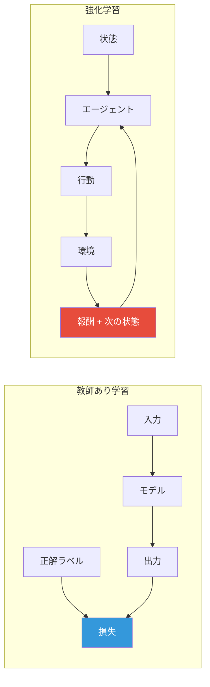
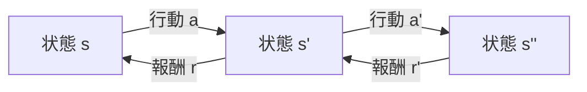
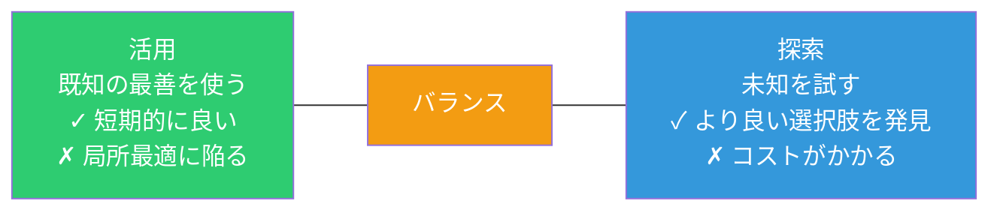
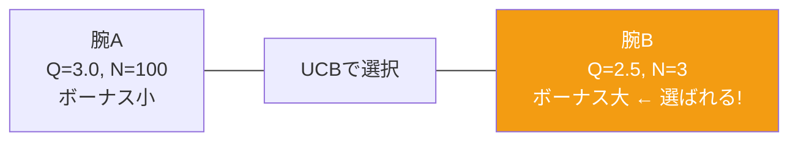

# 強化学習の基礎とバンディット

## 教師あり学習との違い



| | 教師あり学習 | 強化学習 |
|:---:|:---:|:---:|
| **フィードバック** | 正解ラベル（直接的） | 報酬（評価的） |
| **データ** | 固定データセット | 行動に依存して変化 |
| **目標** | 正解を当てる | 累積報酬を最大化 |

---

## マルコフ決定過程 (MDP)



| 要素 | 説明 |
|---|---|
| **S** | 状態の集合 |
| **A** | 行動の集合 |
| **P(s'\|s,a)** | 遷移確率 |
| **R(s,a,s')** | 報酬 |
| **γ** | 割引率 (0 ≤ γ ≤ 1) |

**マルコフ性**: 次の状態は現在の状態と行動にのみ依存し、過去の履歴には依存しない。

---

## 価値関数

```mermaid
graph TD
    subgraph "V&#40;s&#41;: 状態価値関数"
        A["状態sにいることの価値<br/>V = E[Σ γᵗrₜ | s₀=s]"]
    end
    subgraph "Q&#40;s,a&#41;: 行動価値関数"
        B["状態sで行動aを取ることの価値<br/>Q = E[Σ γᵗrₜ | s₀=s, a₀=a]"]
    end

    B --> |"Q から方策を導出"| Policy["π&#40;s&#41; = argmax_a Q&#40;s,a&#41;"]

    style Policy fill:#2ecc71,color:#fff
```



Q関数があれば、各状態でQ値が最大の行動を選ぶだけで最適方策が得られる。

---

## 探索と活用のジレンマ



---

## 多腕バンディット問題

K本のスロットマシン（腕）の報酬分布が未知。報酬を最大化するにはどの腕を引くか？

探索と活用のジレンマを最も純粋な形で体現する問題。

### Epsilon-Greedy

```mermaid
graph TD
    Rand["乱数生成"] --> Check{"< ε ?"}
    Check -->|"Yes &#40;確率ε&#41;"| Explore["ランダムに腕を選択<br/>&#40;探索&#41;"]
    Check -->|"No &#40;確率1-ε&#41;"| Exploit["推定価値最大の腕<br/>&#40;活用&#41;"]
```



価値の推定はインクリメンタル平均で更新：

```
Q(a) ← Q(a) + (1/N(a)) × (r - Q(a))
        ─────────────────────────────
        新しい推定 = 古い推定 + ステップサイズ × 誤差
```

### UCB (Upper Confidence Bound)

```
UCB(a) = Q(a) + c × √(ln(t) / N(a))
         ────   ─────────────────────
         活用          探索ボーナス
```

εグリーディが「ランダムに探索」するのに対し、UCBは**不確実性が高い腕を優先的に探索**する。



あまり選ばれていない腕（N(a)が小さい）はボーナスが大きくなり探索される。理論的に後悔 (regret) が O(log t) であることが証明されている。
