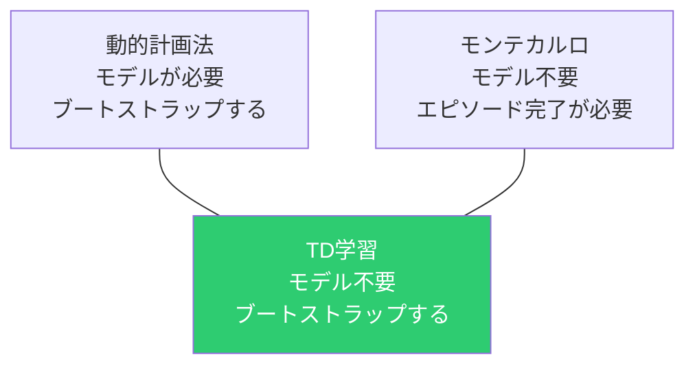

# 動的計画法と TD学習

## ベルマン方程式

すべての強化学習アルゴリズムの共通基盤。

```
V(s) = r + γ × V(s')
       ─   ─────────
       今    将来の価値
```

**現在の価値 = 即時報酬 + 割引された将来の価値**

---

## 動的計画法 (DP)

**前提**: 環境モデル（遷移確率 P、報酬 R）が完全に既知。

### 価値反復法

ベルマン最適方程式を繰り返し適用：

```mermaid
graph LR
    Init["V = 0 で初期化"] --> Update["全状態で更新:<br/>V&#40;s&#41; ← max_a Σ P&#40;s'|s,a&#41;[R + γV&#40;s'&#41;]"]
    Update --> Check{"変化量 < θ ?"}
    Check -->|No| Update
    Check -->|Yes| Policy["方策を導出:<br/>π&#40;s&#41; = argmax_a ..."]

    style Policy fill:#2ecc71,color:#fff
```



### 方策反復法

```mermaid
graph LR
    Init["ランダム方策 π"] --> Eval["方策評価<br/>πのもとでV&#40;s&#41;を計算"]
    Eval --> Improve["方策改善<br/>V&#40;s&#41;に基づきπを更新"]
    Improve --> Check{"方策が変化?"}
    Check -->|Yes| Eval
    Check -->|No| Done["最適方策"]

    style Done fill:#2ecc71,color:#fff
```



### 比較

| | 価値反復 | 方策反復 |
|:---:|:---:|:---:|
| **各反復の計算** | 軽い（max） | 重い（連立方程式） |
| **反復回数** | 多い | 少ない |

---

## TD学習

**モデル不要**。経験から直接学習する。

### TD更新の核心

```mermaid
graph LR
    S["状態 s"] -->|"行動 a"| S2["状態 s'"]
    S2 -->|"報酬 r"| TD["TD更新"]

    subgraph "TD更新"
        Target["TD目標 = r + γV&#40;s'&#41;"]
        Error["TD誤差 = 目標 - V&#40;s&#41;"]
        Update2["V&#40;s&#41; ← V&#40;s&#41; + α × TD誤差"]
    end

    style Error fill:#f39c12,color:#fff
```



```
V(s) ← V(s) + α × [r + γV(s') - V(s)]
                     ─────────   ────
                      TD目標      現在の推定
```

**ブートストラップ**: 推定値で推定値を更新する。正解がなくても次の状態の推定値を使える。

### DP vs モンテカルロ vs TD



| | DP | モンテカルロ | TD |
|:---:|:---:|:---:|:---:|
| **モデル** | 必要 | 不要 | 不要 |
| **更新タイミング** | 全状態 | エピソード終了後 | 毎ステップ |
| **ブートストラップ** | する | しない | する |

---

## Q-Learning（Off-policy）

```
Q(s,a) ← Q(s,a) + α × [r + γ × max_a' Q(s',a') - Q(s,a)]
                              ─────────────────
                              次の状態で最善の行動を仮定
```



```mermaid
graph TD
    Select["行動選択:<br/>εグリーディ&#40;探索&#41;"] --> Act["環境と相互作用"]
    Act --> Update["Q値更新:<br/>max で最適行動を仮定&#40;学習&#41;"]
    Update --> Select

    Note["行動方策 ≠ 学習方策<br/>= Off-policy"]

    style Note fill:#f39c12,color:#fff
```

**Off-policy**: εの確率でランダムに動くが、学習では「次は最適に動く」と仮定して更新。

---

## SARSA（On-policy）

```
Q(s,a) ← Q(s,a) + α × [r + γ × Q(s',a') - Q(s,a)]
                              ──────────
                              実際に取った行動a'
```

名前の由来: **(S, A, R, S', A')** の五つ組を使うから。

**On-policy**: 実際に取った行動 a' を使って更新。探索行動の影響を受ける。

### Cliff Walking での違い

```
START ────────────────────── GOAL
  │                           │
  │      安全な経路 (SARSA)    │
  │   ┌─────────────────┐    │
  │   │                 │    │
  ├───┤  崖 (落ちると-100) ├───┤
  └───┴─────────────────┴────┘
        最短経路 (Q-Learning)
```

| | Q-Learning | SARSA |
|:---:|:---:|:---:|
| **学習する経路** | 崖の際（最短） | 崖から離れた（安全） |
| **学習中のリスク** | 崖に落ちやすい | 安全 |
| **学習する方策** | 理想上の最適 | 探索込みで安全 |
