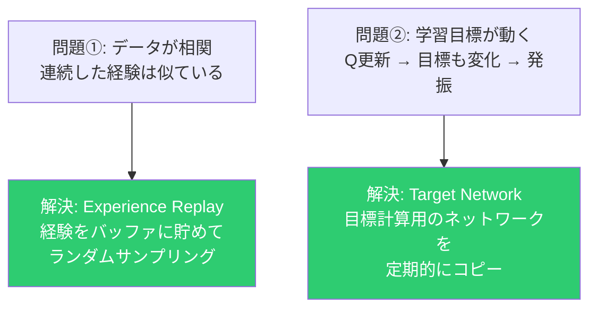

# 深層強化学習

DLとRLの融合。ニューラルネットワークで価値関数や方策を近似する。

```mermaid
graph TD
    subgraph 価値ベース
        QL["Q-Learning<br/>&#40;テーブル&#41;"] -->|"NNで近似"| DQN2["DQN<br/>&#40;ニューラルネット&#41;"]
    end
    subgraph 方策ベース
        PG["方策勾配法"] --> RF["REINFORCE"]
    end

    style DQN2 fill:#3498db,color:#fff
    style RF fill:#e67e22,color:#fff
```



---

## REINFORCE

### アイデア：方策を直接最適化する

```mermaid
graph LR
    State["状態 s"] --> Policy["方策 π&#40;a|s; θ&#41;<br/>softmax線形方策"]
    Policy --> Action["行動 a"]
    Action --> Env["環境"]
    Env --> Reward["報酬 r"]
    Reward --> Update["方策勾配で<br/>θを更新"]
    Update --> Policy

    style Policy fill:#e67e22,color:#fff
```



### 方策勾配定理

```
∇J(θ) = E[ Σₜ ∇log π(aₜ|sₜ; θ) × Gₜ ]
```

直感的な解釈：

```mermaid
graph TD
    G[Gₜ の符号] --> Pos{"Gₜ > 0<br/>良い結果"}
    G --> Neg{"Gₜ < 0<br/>悪い結果"}
    Pos --> Up["log π&#40;a|s&#41; を増加<br/>→ この行動の確率を上げる"]
    Neg --> Down["log π&#40;a|s&#41; を減少<br/>→ この行動の確率を下げる"]

    style Up fill:#2ecc71,color:#fff
    style Down fill:#e74c3c,color:#fff
```



### ベースライン

```
∇J(θ) = E[ Σₜ ∇log π(aₜ|sₜ) × (Gₜ - b) ]
```

報酬の平均 b を引くことで分散を削減。期待値は変えずにノイズを減らす。

### REINFORCEの限界

| 問題 | 原因 |
|---|---|
| 高分散 | モンテカルロ推定 |
| サンプル効率が悪い | 各経験を1回だけ使用 |
| 学習が不安定 | 分散の大きい勾配 |

---

## DQN

### テーブル → ニューラルネット

```mermaid
graph LR
    subgraph "Q-Learning"
        T["Q-テーブル<br/>Q[s][a]<br/>各状態を独立に記憶"]
    end
    subgraph "DQN"
        N["Q-ネットワーク<br/>Q&#40;s; θ&#41;<br/>似た状態で汎化"]
    end

    T -->|"大きな状態空間<br/>では不可能"| N

    style N fill:#3498db,color:#fff
```



### 単純な置き換えの問題と解決策



### Experience Replay

```mermaid
graph LR
    Exp["経験<br/>&#40;s, a, r, s', done&#41;"] --> Buffer["リプレイバッファ<br/>容量: 10,000"]
    Buffer --> Sample["ランダムに<br/>batch_size個<br/>サンプリング"]
    Sample --> Train["ミニバッチ学習"]

    style Buffer fill:#3498db,color:#fff
```



効果：
- データの相関を破壊 → i.i.d.に近づける
- 各経験を複数回使える → サンプル効率向上

### Target Network

```mermaid
graph LR
    QNet["Q-Network<br/>&#40;毎ステップ更新&#41;"] -->|"定期的にコピー"| TNet["Target Network<br/>&#40;固定&#41;"]
    TNet --> Target["TD目標を計算:<br/>r + γ max Q_target&#40;s', a'&#41;"]
    Target --> Loss["損失 = &#40;Q&#40;s,a&#41; - target&#41;²"]
    Loss --> QNet

    style TNet fill:#9b59b6,color:#fff
```



目標を固定することで「動く目標を追いかける」不安定性を解消。

### 学習アルゴリズム全体

```mermaid
graph TD
    A["① 行動選択: ε-greedy"] --> B["② 環境と相互作用"]
    B --> C["③ バッファに保存"]
    C --> D["④ バッファからランダムサンプリング"]
    D --> E["⑤ TD目標 = r + γ max Q_target&#40;s'&#41;"]
    E --> F["⑥ 損失 = MSE&#40;Q&#40;s,a&#41;, target&#41;"]
    F --> G["⑦ 逆伝播でQ-Networkを更新"]
    G --> H["⑧ 定期的にTarget Networkをコピー"]
    H --> I["⑨ εを減衰"]
    I --> A

    style E fill:#9b59b6,color:#fff
    style G fill:#3498db,color:#fff
```



### 本実装の設計

DLフレームワーク（Linear, ReLU, Sequential, Adam）をそのまま使ってQ-Networkを構築：

```python
Sequential([
    Linear(state_dim, 64), ReLU(),
    Linear(64, 64),        ReLU(),
    Linear(64, action_dim),
])
```

これにより「DLとRLの接続点」を体験できる。

---

## 手法の全体マップ

```mermaid
graph TD
    subgraph "モデルあり"
        DP["動的計画法<br/>&#40;価値反復・方策反復&#41;"]
    end

    subgraph "モデルなし × 価値ベース"
        QL2["Q-Learning / SARSA<br/>&#40;テーブル&#41;"]
        DQN3["DQN<br/>&#40;ニューラルネット&#41;"]
        QL2 --> DQN3
    end

    subgraph "モデルなし × 方策ベース"
        RF2["REINFORCE"]
    end

    Bandit["バンディット<br/>&#40;探索と活用の基本&#41;"] --> QL2
    Bandit --> RF2

    style Bandit fill:#f39c12,color:#fff
    style DP fill:#95a5a6,color:#fff
    style DQN3 fill:#3498db,color:#fff
    style RF2 fill:#e67e22,color:#fff
```


